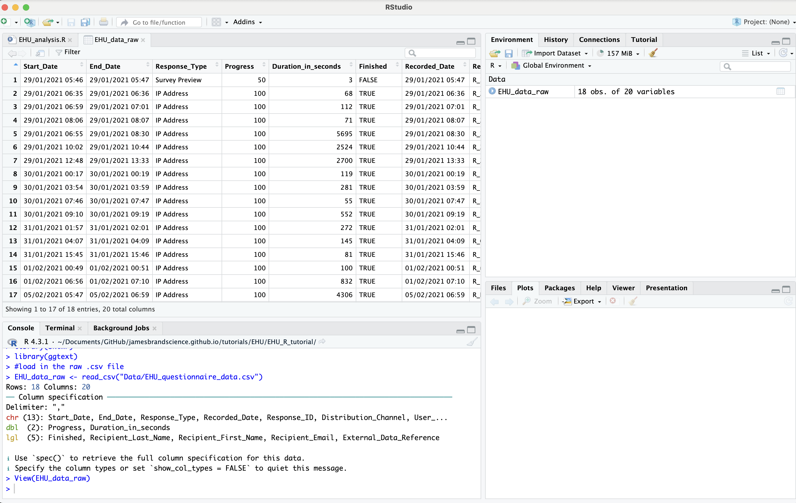
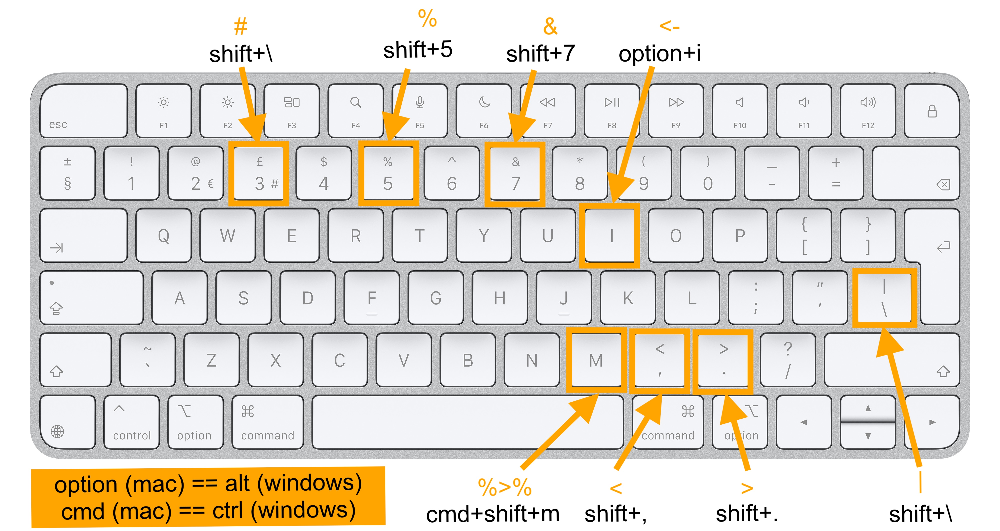
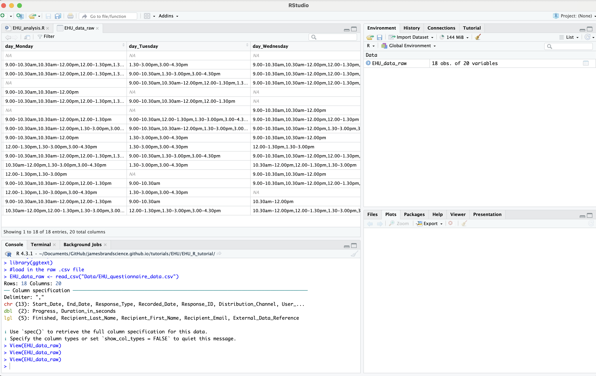

```{r setup, include=FALSE}
knitr::opts_chunk$set(echo = TRUE,
                      comment = NA)
knitr::knit_hooks$set(error = function(x, options) {
  paste0("<pre style=\"color: #B5271E;\"><code>", x, "</code></pre>")
})

library(tidyverse)
library(tippy)
library(fontawesome)
library(openxlsx)
library(readxl)
library(skimr)
library(ggtext)
library(janitor)

set.seed(123)

# EHU_data <- read_csv("EHU_questionnaire.csv")
# 
# EHU_data <- read_csv("EHU_questionnaire.csv") %>%
#   rownames_to_column() %>%
#   mutate(`vaše jméno` = fct_anon((factor(rowname)), prefix = "anonymised"),
#          Finished = ifelse(`Response Type` == "Survey Preview", FALSE, Finished),
#          Progress = ifelse(`Response Type` == "Survey Preview", 50, Progress)) %>%
#   select(-1, -5, -15:-16, -25:-30) %>%
#   rename_with(~ str_replace(string = ., pattern = "\\(", replacement = "")) %>%
#   rename_with(~ str_replace(string = ., pattern = "\\)", replacement = "")) %>%
#   rename_with(~ str_replace_all(string = ., pattern = " - | ", replacement = "_"))
# 
# names(EHU_data)
# 
# write.csv(EHU_data, "Data/EHU_questionnaire_data.csv", row.names = FALSE)
# 
# write.xlsx(EHU_data, "Data/EHU_questionnaire_data.xlsx")

```

```{css echo=FALSE}
.goog-tooltip {
    display: none !important;
}
.goog-tooltip:hover {
    display: none !important;
}
.goog-text-highlight {
    background-color: transparent !important;
    border: none !important; 
    box-shadow: none !important;
}

```

---

### Worksheet translations available

Disclaimer: may not be very accurate...

<div id="google_translate_element"></div>

<script>

function googleTranslateElementInit() {

new google.translate.TranslateElement({

pageLanguage: 'en'

}, 'google_translate_element');

}

</script>

<script src="//translate.google.com/translate_a/element.js?cb=googleTranslateElementInit">

</script>

---

# Outline

This workshop session will focus on using the `tidyverse` package in R to complete common data processing and visualisation steps.

We will focus on the following key learning outcomes:

- **How to work with a data set that is quite messy**

- **How to clean up the data by using various Tidyverse functions**

- **How to understand different types of data and the ways to structure them**

# Pre-requisites

- You do not need to be an expert in R to complete this worksheet

- If you know R but are unfamiliar with the Tidyverse, I hope you will find it helpful and see the differences with base R coding

- If you are familiar with the Tidyverse, I hope you might find something new in here

# Download the worksheet materials

**You can download a .zip folder which contains all the required materials by clicking on the link below:**

---

<span>`r fa("download")`&nbsp;&nbsp;[EHU_R_tutorial.zip](https://raw.githubusercontent.com/jamesbrandscience/jamesbrandscience.github.io/master/tutorials/EHU/EHU_R_tutorial.zip) </span>

---

Once you have downloaded the folder, **double click it to make sure it has been unzipped**.


## Files

You should see the following folders/files (you can see a brief description by hovering over each item):

<dl>
<dt>`r fa("folder-open")` `Data`</dt>

<dd>`r fa("file-csv")` `r tippy::tippy("<code>EHU_questionnaire_data.csv</code>", tooltip = "<span style='font-size:14px;'>the data we will be using in .csv format (comma separated values)<span>",  allowHTML = TRUE, placement = "right")`</dd>

<dd>`r fa("file-excel")` `r tippy::tippy("<code>EHU_questionnaire_data.xlsx</code>", tooltip = "<span style='font-size:14px;'>the data we will be using in .xlsx format (from MS Excel)<span>",  allowHTML = TRUE, placement = "right")`</dd>

<dd>`r fa("file-csv")` `r tippy::tippy("<code>missing_data_example.csv</code>", tooltip = "<span style='font-size:14px;'>example data for working with missing values in .csv format (comma separated values)<span>",  allowHTML = TRUE, placement = "right")`</dd>

<dd>`r fa("file-excel")` `r tippy::tippy("<code>missing_data_example.xlsx</code>", tooltip = "<span style='font-size:14px;'>example data for working with missing values in .xlsx format (from MS Excel)<span>",  allowHTML = TRUE, placement = "right")`</dd>

<dt>`r fa("r-project")` `r tippy::tippy("<code>EHU_analysis.R</code>", tooltip = "<span style='font-size:14px;'>the R script you will use to practice the exercises<span>",  allowHTML = TRUE, placement = "right")`</dt>

<dt>`r fa("file-code")` `r tippy::tippy("<code>EHU_tidyverse.Rmd</code>", tooltip = "<span style='font-size:14px;'>the R Markdown document used to create this worksheet (these documents will be covered at anoter session)<span>",  allowHTML = TRUE, placement = "right")`</dt>

<dt>`r fa("file-code")` `r tippy::tippy("<code>EHU_tidyverse.html</code>", tooltip = "<span style='font-size:14px;'>the .html file you are viewing, generated from the R Markdown document (you can view in a web browser offline)<span>",  allowHTML = TRUE, placement = "right")`</dt>

<dt>`r fa("folder-open")` `Plots`</dt>

<dd>`r fa("image")` `r tippy::tippy("<code>EHU_data_plot.png</code>", tooltip = "<span style='font-size:14px;'>the final visualisation of the data that we will create<span>",  allowHTML = TRUE, placement = "right")`</dd>

<dt>`r fa("folder-open")` `r tippy::tippy("<code>screenshots</code>", tooltip = "<span style='font-size:14px;'>the screenshots used in the tutorial<span>",  allowHTML = TRUE, placement = "right")`</dt>
</dl>

## Open the `EHU_analysis.R` file

The main file we will be using in this worksheet is `EHU_analysis.R`.

You should open the file in RStudio.

It should look like the screenshot below:


You will notice that there is not much code in the script, we will steadily add code to it throughout the worksheet.

Remember, that any lines of code that have a `#` at the start are comments. Comments are only there to help you and others understand the actual lines of code, which do not start with a `#`. Comments in code are good, please use them!

## IMPORTANT

In order for the script to work properly **YOU MUST RUN THE LINE THAT SAYS:**

```{r eval=FALSE}
setwd(dirname(rstudioapi::getActiveDocumentContext()$path))

```

This tells R that you want to work in the folder called `EHU_R_tutorial`. Without getting too complicated, it just makes things easier for the code to work!

Learning about directory structures is important, but we probably don't have time today. See [this post by Michael Frank](http://babieslearninglanguage.blogspot.com/2017/01/onboarding.html).

<div class="alert alert-info">

<strong>`r fa("lightbulb")` Tip</strong><br/>

You can run a line of code by clicking anywhere on the line and pressing:

`cmd + ENTER` (Mac)

`ctrl + ENTER`(Windows)

</div>

---

# 1. Load in the tidyverse

The tidyverse is a collection of packages that makes using R much easier (in my opinion). The *tidy* philosophy incorporates design features that should hopefully make learning, using and understanding your and others code more achievable. See the website for more details [https://www.tidyverse.org](https://www.tidyverse.org).

The first thing we need to do is load in the 'tidyverse` package to our R session library, which contain specific functions that will make completing the learning outcomes easier. I assume you have installed the package, if not see the next part.

### If you have already installed the tidyverse

To load the package, copy and paste, and then run the code below in your `EHU_analysis.R` file. 

```{r eval=FALSE}
#loads the package
library(tidyverse)

```

If it worked you should see (in the output section/bottom): 


### If you have not installed the tidyverse

If you got an error saying:

`Error in library(tidyverse) : there is no package called ‘tidyverse’`

You will **need** to install the tidyverse package and then add it to the library. This can be done by running the following code:

```{r eval=FALSE}
#installs the package
install.packages("tidyverse")

#loads the package
library(tidyverse)

```

<div class="alert alert-success">

<strong>`r fa("lightbulb")` Bonus</strong><br/>

If you close RStudio and open it again, do you need to run the `library(tidyverse)` code again for the script to work?<br/>`r tippy::tippy("<strong>[answer]</strong>", tooltip = "<span style='font-size:14px;'>YES, this is so you and other people can see what packages they need in order to reproduce your output. It is good to put these lines at the start of your script<span>",  allowHTML = TRUE, placement = "right")`

Once you have installed a package, do you need to reinstall it every time your restart RStudio?<br/>`r tippy::tippy("<strong>[answer]</strong>", tooltip = "<span style='font-size:14px;'>NO, once a package is installed on your computer, it is saved to your computer. You might have to update the package occasionally using the update.packages() function<span>", allowHTML = TRUE, placement = "right")`

</div>

# 2. Install other packages

In order to do some other cool things in this worksheet, we will need to install and load some other packages, `skimr`, `ggtext` and also `readxl` (which does not need to be installed, just loaded).

Make sure the below code is run before continuing.

```{r eval=FALSE}
#install the packages
install.packages("skimr")
install.packages("ggtext")

#load the package
library(readxl)
library(skimr)
library(ggtext)

```


# 3. Introduction to functions (for beginners)

This section is intended to give those not too familiar with coding a bit of extra information on functions. You can skip to the next section if you have coded before.

In order for R to understand what we want to do, we can make use of the many functions that it understands. Functions are similar to verbs, in that they can do lots of different things, but in order to use them you need to learn how they work. For example, the English verb *to read* works well in a sentence like 'Jan read the book', but maybe does not work as well in the sentence 'read speak'. This is because the first sentence has a subject ('Jan') and an object ('the book'), whereas the second sentence only has another verb ('speak'), which does not make for a good sentence.

In R there are also syntactic-style rules for how functions work (please note that natural languages and programming languages are very different, I am just using the terms verbs, nouns, syntax etc for an analogy).

The function `print()` is used to print something. If you try to run the code as it is (i.e. just `print()`) you will get an error saying:

```{r error=TRUE}
print()

```

This is because it needs something to print, just as the verb *read* needs the noun *book*, this is indicated by the error message saying <span style="color:#B5271E;font-family:'Monaco'">argument "x" is missing</span>. So we need something inside the brackets of the function for the function to work (this is called the *argument*).

```{r}
print("Hello, world")

```

In the above example, our function is `print` and our argument is `"Hello, world"`, the output to this code is therefore going to print `"Hello, world"`.

There are lots of different functions that R uses to make your code work. You can use ones from packages (such as the Tidyverse) or write your own. We already used the `library` function at the beginning, which loaded in the Tidyverse.

Some functions have, or even need, multiple arguments. RStudio makes understanding what the arguments to a function are, as well as what functions are available.

**Step 1.**

In your R script, if you start to type the word `plo` you will see a dropdown menu appear (you can also press `tab`/<span style='font-size:18pt;'>&#8677;</span> key on your keyboard if you don't see it automatically).

This menu lists all the functions that begin with "plo".

Choose the function `plot` (either by clicking on it or by pressing the down key/<span style='font-size:18pt;'>&darr;</span> and press `tab`).

This will automatically generate the code `plot()`.

The yellow information box gives you details about what the function does.

**Step 2.**

Make sure your cursor is inside the brackets of the `plot()` function. Press `tab` again.

A new dropdown list appears, giving you the main arguments for the `plot` function.

You will see they are `x = ` and `y = `. This is because to plot something in this function you normally need data for the x and y axes.


Fill in the function with the following arguments:

`x = 1, y = 2`

Your final code should look like this:

```{r eval=FALSE}
plot(x = 1, y = 2)

```


<div class="alert alert-success">

<strong>`r fa("lightbulb")` Bonus</strong><br/>

In the line of code below:

`plot(x = time, y = fun)`

What is the function? `r tippy::tippy("<strong>[answer]</strong>", tooltip = "<div style='font-size:14px'>plot</div>",  allowHTML = TRUE, placement = "right")`

What is the argument? `r tippy::tippy("<strong>[answer]</strong>", tooltip = "<span style='font-size:14px;'>time and fun (there can be more than 1 argument to a function)<span>", allowHTML = TRUE, placement = "right")`

Do you think the line of code `sessionInfo()` will work? `r tippy::tippy("<strong>[answer]</strong>", tooltip = "<span style='font-size:14px;'>It does work, there are functions that do not need arguments or the function has default values that will allow it to work<span>", allowHTML = TRUE, placement = "right")`

</div>

# 4. The data

The data we will be using is from the questionnaire asking for your availability for future R workshop sessions (the link is [here](http://canterbury.qualtrics.com/jfe/form/SV_bvdvS6WJz7NITWe) if you want to see the design of the questionnaire). 

The next thing we need to do is load in the data, so we can practice some data processing procedures.

### `read_csv()`

We can load in the data using the `read_csv()` function.

Inside the brackets of the function we need to specify where the file is located and what it is called, i.e. Data > EHU_questionnaire_data.csv (think of this as doing the click version of File > Open > click > click > click... in Excel)

We also need to store the data and assign it a name, we will call it `EHU_data_raw` (we assign a name to an object by using this format`name <- object`)

```{r message=FALSE}
#load in the raw .csv file
EHU_data_raw <- read_csv("Data/EHU_questionnaire_data.csv")

```

You should now see that there is a new object in the environment (top left box of RStudio).

<div class="alert alert-info">

<strong>`r fa("lightbulb")` Tip</strong><br/>

Note that I refer to this as a *raw* file. This is because it has not been modified, processed or directly edited.<sup>1</sup>

It is the starting point of our data story. Everything we do after will be changes that we (or anybody else) can reproduce.

Please, please, please never change the raw file! Going in to Excel/spreadsheet software and changing it in any way will compromise the integrity of your data.

Any changes you do make should have a trail (a record of what you have done), which is your R code.

<sup>1</sup><small>Disclaimer: the data has actually been modified to anonymise names and remove the feedback comments</small>

</div>


### `read_excel()`

As researchers, we may not always acquire our data in a `.csv` format. Naturally, there may be files that are in the `.xlsx` format. Using the `read_csv` function will not work for these files. We can use the `read_excel` for this, which is in the `readxl` package.

We will not be using the excel version of the data for this worksheet, but will focus on the .csv version. This section is to show you how to read in excel files.

```{r}
#load in the excel version of the data
EHU_data_raw_xlsx <- read_excel("Data/EHU_questionnaire_data.xlsx")

```

<div class="alert alert-info">

<strong>`r fa("lightbulb")` Tip</strong><br/>

I prefer to use .csv files when working in R because:

- They are normally smaller in size (for large datasets)
- You do not need Excel to open them (when sharing the data with others who do not have Excel)
- The file does not contain any text formatting (Excel files may change numbers/text to dates, e.g. "10-12" becomes "10-Dec")
- They do not use multiple sheets

See [this post by Luis Darcy Verde Arregoitia](https://luisdva.github.io/pls-don't-do-this/) about why excel can be problematic.

</div>

## Understanding the data

### `View()`

We can get an idea of what the data looks like in a number of ways.

We can use the `View()` function to open a new tab which allows for a spreadsheet style representation (note, this is not like excel where you can directly edit the data).

You can scroll up/down to see the other rows or left/right to see the other columns.

```{r eval=FALSE}
#open new tab showing the raw data
View(EHU_data_raw)

```

You should see this (make sure that the **View** has a a capital **V**):



### Missing values

You might have noticed that there are some cells in our data that say `NA` (and look slightly grey when we use `View`).

These are called **missing values** and occur when the cell is **empty** or has **NA** as the value

You can specify in the `read_csv()` or `read_excel()` functions if you want to make any particular value in your data a NA value.

E.g. If you have the value `NULL` in your data, you can automatically code `NULL` as an `NA` using this code:

```{r eval=FALSE}
#only code values that are NULL as NAs
#csv file
missing_data_example <- read_csv("Data/missing_data_example.csv", na = "NULL")

#xlsx file
missing_data_example <- read_excel("Data/missing_data_example.xlsx", na = "NULL")

```

Note that this will now only code "NULL" values as missing (nothing else), but we can make a vector of values if we want to specify multiple values as NAs.

The code below will read in `NULL`, `NA`, `empty` (""), `10` and `hello` values as missing. They will all appear as `NA` in our `missing_data_example2` object:

```{r eval=FALSE}
#code values that are NULL, NA, 10 or hello empty as NAs
#csv file
missing_data_example2 <- read_csv("Data/missing_data_example.csv", na = c("NULL", "NA", "", 10, "hello"))

#xlsx file
missing_data_example2 <- read_excel("Data/missing_data_example.xlsx", na = c("NULL", "NA", "", 10, "hello"))

```

### Column types

Viewing the data visually can be useful for quickly inspecting if the data looks how you expected (i.e. has the file been read properly). However, it does not tell you much about how the data is structured.

Data is normally a bit more complicated when you load it into R. There are (for most data sets) normally multiple columns and multiple rows.

Each of your variables/columns will be assigned a column specification/type:

| Specification      | Example    | Notes   | More information    |
| ----------- | --------------- | -------------------------- | ----------- |
| `numeric`/`integer`/`double`      | 3.14, 10, 10000      |as long as there are only numbers in the column (you don't need to worry which name it is, they are all numbers)    |  [link](https://statsandr.com/blog/data-types-in-r/#numeric)       |
| `character`  | "one", "1", "hello"        |contains some form of text (which is anything inside speech marks/" ")       | [link](https://r4ds.had.co.nz/strings.html)       |
| `factor`  | "one", "1", "hello"        |different from character/string as there are levels, which makes organising easier      | [link](https://r4ds.had.co.nz/factors.html)       |
| `date`/`time`  | "05-03-2021",<br/>"05-Mar-2021 12:34:56",<br/>"2021-03-05 16:00:00 UTC"         |special type that evaluates dates/times, see the link, they can be complicated      | [link](https://r4ds.had.co.nz/dates-and-times.html)       |
| `logical`  | TRUE, FALSE         |special type that states if the value if either TRUE or FALSE, note not a character/string/factor      | [link](https://bookdown.org/ndphillips/YaRrr/logical-indexing.html)       |

### Data summary with `skim()`

We can see a really nice summary of the data using the`skim()`function from the `skimr` package.

This gives you and others a quick and easy way to understand the structure of your data.

```{r}
#create a summary object
EHU_data_raw_summary <- skim(EHU_data_raw)

#print the summary
EHU_data_raw_summary

```

<div class="alert alert-success">

<strong>`r fa("lightbulb")` Bonus</strong><br/>

Use the `EHU_data_raw_summary` output to find out the following:

How many **rows** of data are there? `r tippy::tippy("<strong>[answer]</strong>", tooltip = "<span style='font-size:14px;'>18<span>",  allowHTML = TRUE, placement = "right")`

How many **columns** of data are there? `r tippy::tippy("<strong>[answer]</strong>", tooltip = "<span style='font-size:14px;'>20<span>",  allowHTML = TRUE, placement = "right")`

How many **columns are character variables**? `r tippy::tippy("<strong>[answer]</strong>", tooltip = "<span style='font-size:14px;'>13<span>",  allowHTML = TRUE, placement = "right")`

How many **missing values** are there in the character variable **day_Friday**? `r tippy::tippy("<strong>[answer]</strong>", tooltip = "<span style='font-size:14px;'>1<span>",  allowHTML = TRUE, placement = "right")`

What is the **mean** for the numeric variable **Progress**? `r tippy::tippy("<strong>[answer]</strong>", tooltip = "<span style='font-size:14px;'>97.2<span>",  allowHTML = TRUE, placement = "right")`

</div>

# 5. Data processing functions

Now we have looked at our data, we can see that it looks really messy. So we might want to process it to make it easier to use. 

Some main issues, solutions and the functions we will use:

| Issue      | Solution    | Function   |
| ---------------------------- | ----------------- | ------------- |
| There are columns we do not need | remove them | `select()` |
| The column names are a bit messy | rename them | `rename()` |
| There are rows we do not need | remove them | `filter()` |
| The data needs to be in long/wide format | reshape it | `pivot_longer()` |
| Some columns contain multiple values in a single cell | separate them | `separate_rows()` |
| Some columns need to be created/modified | create/modify them  | `mutate()` |
| Need to know summary statistics from the data | summarise it | `summarise()` |

### Cheatsheet


### The pipe<br/>`%>%`

Before we start using any of the above functions, we will first learn how to use the pipe (`%>%`).

**What is it?**

The pipe is a special shorthand/operator that allows you to combine multiple lines of related code in a neat and tidy sequence. Think of it as a way to tell R **\*\*AND THEN DO THIS\*\***.

Pipes are really helpful and we will be using them throughout this worksheet.

**keyboard shortcut**

Instead of having to type the pipe each time you use it, you can use the R shortcut:

`Ctrl + Shift + M` (Windows)

`Cmd + Shift + M` (Mac)

Other shortcuts can be found in the picture below:



**A non-code analogy**

Imagine a situation where the following sequence occurs...

1. You wake up
2. You get out of bed
3. You walk to the kitchen
4. You make breakfast

If this was R code it might look like this:

```{r eval=FALSE}
you1 <- wake_up(your_name)
you2 <- get_out(you1, "bed")
you3 <- walk(you2, "kitchen")
you4 <- make(you3, "breakfast")

```

This is not the most efficient code as there is a lot of **duplication** of the word **you** and **<-**. You also make 4 new objects (you1, you2, you3, you4), which might get a bit confusing if you have a lot of steps.

This is where the pipe can be really useful.

If you are combining multiple steps to the same initial data set, the pipe can link these steps together, removing the need for redundant features (such as lots of **you <-**)

This is how we would write the sequence using the pipe.

```{r eval=FALSE}
you <- wake_up(your_name) %>%
  get_out("bed") %>%
  walk("kitchen") %>%
  make("breakfast")

```

This approach knows the data set you are working with (your_name) and updates that data each time the pipe is used.

**an actual example**

Let's try to use the pipe with our `EHU_data_raw` data. We will apply the `names()` function to the data so we can see the column names. Then the `str_to_upper` function to make the names uppercase.

```{r}
EHU_data_raw %>% #use this data
  names() %>% #get the column names
  str_to_upper() #make them all upper case
  
```

### removing/keeping variables<br/>`select()`

If we have another look at our data set (`EHU_data_raw`) we can see there are a few columns that are empty - they only contain NA values.

Therefore, to make the data a bit more clean, we may want to remove these variables.

We will remove the variables:

- `Recipient_Last_Name`
- `Recipient_First_Name`
- `Recipient_Email`

We can do this with the `select()` function.

Inside the function, we need to specify which variables we want to remove.

Below are some examples of the ways you can do this...

**specify using the variable name**

If you know the variable name(s), you can just write them inside the brackets of `select` (separated by a comma).

i.e. the function should look like this

```{r eval=FALSE}
#KEEP VARIABLES
#keeps the two variables and removes everything else
data %>%
  select(variable_to_keep1,
   variable_to_keep2)

#REMOVE VARIABLES
#removes the two variables and keeps everything else
data %>%
  select(-variable_to_remove1,
         -variable_to_remove2)

```

<div class="alert alert-info">

<strong>`r fa("lightbulb")` Tip</strong><br/>

Note that if you want to remove a variable in this way make sure you use a `-` before the variable.

You also do not use quotation marks when specifying the names.

We will use `names()` at the end to print out the variable names that are kept, this is just so we can see the names, normally we would not do this part!

</div>

```{r}
EHU_data_raw %>%
  select(-Recipient_Last_Name,
         -Recipient_First_Name,
         -Recipient_Email) %>%
  names()

```

If we want, we can also just specify the variables we want to keep (this is best when you want to keep just a few variables though!).

```{r}
EHU_data_raw %>%
  select(Start_Date,
         End_Date,
         Response_Type,
         Progress,
         Duration_in_seconds,
         Finished,
         Recorded_Date,Response_ID,
         External_Data_Reference,
         Distribution_Channel,
         User_Language,
         memorable_word,
         day_Monday,
         day_Tuesday,
         day_Wednesday,
         day_Thursday,
         day_Friday) %>%
  names()

```

**specify using a selection function**

We can also use some functions that makes choosing variables easier.

Other functions you can use within the `select()` function:

| Function      | Description    | Example   |
| --------------- | -------------------------- | ------------- |
|`starts_with()` | Starts with a specific string | `select(starts_with("hello"))` |
|`ends_with()` | Ends with a suffix | `select(ends_with("hello"))` |
|`contains()` | Contains a string anywhere in the name | `select(contains("hello"))` |
| `matches()` | Matches a regular expression (see [https://regexr.com](https://regexr.com)) | `select(matches("^hello"))` |

For example, we can remove all variables that start with **"Recipient"** using the code below.

<div class="alert alert-info">

<strong>`r fa("lightbulb")` Tip</strong><br/>

Note that if you want to remove variables put a `!` before the selection function e.g. `!starts_with()`

When using these selection functions you are normally working with a string (a character or sequence of character, such as "hello", "hello123"), it is important use quotation marks when using these functions.

They also ignore the capitalisation of letters (i.e. "Hello" is the same as "hello"), make sure you know if it your string needs capitalisation. If you do need capitalised letters you can add the argument `ignore.case = FALSE`, so the code for selecting only variables that start with "Hello" (not "hello") would be `data %>% select(starts_with("Hello", ignore.case = FALSE))`

</div>

```{r}
EHU_data_raw %>%
  select(!starts_with("Recipient")) %>% #remove only variables that start with "Recipient"
  names()

```

You can combine multiple selects using the pipe.

```{r}
EHU_data_raw %>%
  select(!ends_with("Name")) %>% #remove variables ending with "Name"
  select(!contains("Email")) %>% #AND THEN remove variables that contain "Email"
  names()

```

<div class="alert alert-success">

<strong>`r fa("lightbulb")` Bonus</strong><br/>

Can you use one of the selection functions to keep only the variables that start with "day"?<br/>`r tippy::tippy("<strong>[answer]</strong>", tooltip = 'EHU_data_raw %>%<br/>select(starts_with("day"))',  allowHTML = TRUE, placement = "right")`

</div>

### Renaming variables<br/>`rename()`

Now that we know how to remove and keep variables, the next step we will focus on is renaming the variables.

To do this we use the `rename()` function.

Inside the brackets we specify the new name for the variable = the old name.

i.e. the function should look like this `rename(new_name = old_name)`

We can rename multiple variables within the function (by separating the arguments with a comma).

Let us rename the variables `day_Monday`, `day_Tuesday`, `day_Wednesday`, `day_Thursday`, `day_Friday` by renaming them individually and removing the `day_` part.

```{r}
EHU_data_raw %>%
  rename(Monday = day_Monday,
        Tuesday = day_Tuesday,
        Wednesday = day_Wednesday,
        Thursday = day_Thursday,
        Friday = day_Friday) %>%
  names()

```

### removing/keeping rows<br/>`filter()`

Now that we know how to remove/keep and rename variables, the next step will be to filter out data we do not want.

In linguistics research it is common to work with data that needs processing in order to have a clean data set to work with.

For example, in corpus linguistics you might want to filter a corpus to remove function words, in psycholinguistics you might want to remove trials with an extremely long reaction time, in bilingualism research you might want to remove speakers with a specific native language.

It is important that any data processing steps that directly modify or change your raw data in any way are transparent, justified and replicable.

We will use the `filter()` function to remove certain rows of our data.

When filtering data we normally want to do so based on a criteria within a variable, e.g. if you have a variable called `word_type` that contains the values `function` and `content`. If we want to remove the function words from the data we can say:

In our **data**, if **word_type** *is equal to* **"function"**, then keep only those rows.

In code this will look like

```{r eval=FALSE}
data %>%
  filter(word_type == "function")

```

When writing code in R, there are specific ways to 'say' things like *is equal to*, the table below outlines some of these special ways. These are called logical and relational operators. 

**Logical and relational operators in R**

|How a human might say it |How to say it in R | Example (formula) | Example (realistic) |
|-----------------|:---------:|-----------------------|----------------------------|
|is equal to | `==` | variable == "string" | hello == "hi" |
|is not equal to | `!=` | variable != "string" | hello != "bye" |
|is found within a set/vector | `%in%` | variable %in% c("string1", "string2") | hello %in% c("bonjour", "guten tag") |
|is not found within a set/vector | `%in%` | !variable %in% c("string1", "string2") | !hello %in% c("bye", "see you") |
|is smaller than | `<` | variable < number | one < 5 |
|is smaller than or equal to | `<=` | variable <= number | five < 5 |
|is larger than | `>` | variable > number | five > 1 |
|is larger than or equal to | `>=` | variable >= number | one >= 1 |
|is something AND is something else | `&` | variable1 == "string" & variable2 < 5 | hello == "hi" & one < 5 |
|is something OR is something else | `|` | variable1 == "string" \| variable2 < 5| hello == "hi" \| one < 5 | 

The criteria for our filtering is quite simple:

**Remove any participants who did not complete the questionnaire.**

We can look at the variable `Finished` to check this, where we can see that there is 1 participant with a `FALSE` value and 17 with a `TRUE` value (you can use `View(EHU_data_raw)` again or `skim(EHU_data_raw)` and look for the `Finished` variable).

Based on this, we can state that anybody who has a `TRUE` value for the `Finished` variable can be kept in our data.

To do this, we can use the following code:

```{r eval=FALSE}
EHU_data_raw %>%
  filter(Finished == TRUE)

EHU_data_raw %>%
  filter(memorable_word != "hello_test")

```

We can see that we have successfully removed the row that contained the data where `Finished` == `FALSE` and we are left with only the data where `Finished` == `TRUE`.

<div class="alert alert-success">

<strong>`r fa("lightbulb")` Bonus</strong><br/>

If you look again at the `EHU_data_raw` data, you can see that there are a few other variables that we can use to filter out this row.

Can you write the code that filters out the row based on:

The variable `Progress`<br/>`r tippy::tippy("<strong>[answer]</strong>", tooltip = 'EHU_data_raw %>%<br/>filter(Progress == 100',  allowHTML = TRUE, placement = "right")`

The variable `Duration_in_seconds`<br/>`r tippy::tippy("<strong>[answer]</strong>", tooltip = 'EHU_data_raw %>%<br/>filter(Duration_in_seconds > 3',  allowHTML = TRUE, placement = "right")`

The variable `Response_Type`<br/>`r tippy::tippy("<strong>[answer]</strong>", tooltip = 'EHU_data_raw %>%<br/>filter(Response_Type != "Survey Preview',  allowHTML = TRUE, placement = "right")`

The variable `memorable_word`<br/>`r tippy::tippy("<strong>[answer]</strong>", tooltip = 'EHU_data_raw %>%<br/>filter(vaše_jméno != "anonymised18',  allowHTML = TRUE, placement = "right")`

</div>

### Reshaping data<br/>`pivot_longer()`


One key difference between R and spreadsheet style software is that it is optimised to work with **long** data, instead of **wide** data. See [Wickham, 2014](http://vita.had.co.nz/papers/tidy-data.pdf) for reasons why long is preferred. Put simply, thinking about your data when it is in a long format is much easier, efficient and enjoyable (imagine getting a sofa up several floors using an elevator). Thinking about your data in a wide format is often confusing, complicated and counter-intuitive (think about getting a sofa up several floors, using stairs).

**Differences between wide and long data**

|Shape | Description |
|-------- |-------------------------------|
| wide | 1. variables are spread across columns<br/>2. each participant has a row<br/>3. multiple values in a cell |
| long | 1. each variable has a column<br/>2. each observation has a row<br/>3. each value has a cell |

In our `EHU_data_raw` the shape is **wide**, there is one row for each participant, with different observations spread across different columns, even having multiple values in individual cell.

Let's focus on the columns `day_Monday`, `day_Tuesday`, `day_Wednesday`, `day_Thursday`, `day_Friday`, which have data that contains the participants time availability in the cells.



These 5 columns and the data they contain, can be converted into just 2 columns, when they are shaped to be **long**: 

1. `day` (day_Monday, day_Tuesday, day_Wednesday, day_Thursday, day_Friday) - this is called the variable **names** as it contains the column names
2. `time` (9.00-10.30am, 10.30am-12.00pm, etc.) - this is called the variable **values** as it contains the column values

We can change from wide to long using the `pivot_longer` function.

Inside the brackets, we need to specify:

- **which columns** we want to change (cols)
- the **new name** for our **names** column (names_to)
- the **new name** for our **values** column (values_to)

This will give us a basic code format of:

```{r eval=FALSE}
data %>%
  pivot_longer(cols = column_names_you_want_to_change,
               names_to = "new_names_column_name",
               values_to = "new_values_column_name")

```

Let's first use some of the data processing steps to clean up `EHU_data_raw`

- We will create a new data object called `EHU_data_clean`
- This will incorporate some of the data processing steps we have covered so far (`filter` and `select`)
- The `filter` will remove the participant who did not finish
- The `select` will keep only the columns vaše_jméno and the ones that start with "day"
- This data is still in **wide** format

```{r}
#data cleaning steps
EHU_data_clean <- EHU_data_raw %>%
  filter(Finished == TRUE) %>% #remove the participant who did not finish
  select(memorable_word, starts_with("day")) #only keep these variables

```

Now we will change the `EHU_data_clean` using `pivot_longer()` to go from wide to long.

We will call this new long data `EHU_data_long`

```{r}
#make the EHU_data_clean data long
EHU_data_long <- EHU_data_clean %>%
  pivot_longer(cols = starts_with("day"),
               names_to = "day",
               values_to = "time")

```

Let's look at our data...

```{r eval=FALSE}
#view the long data
View(EHU_data_long)

```

<div class="alert alert-success">

<strong>`r fa("lightbulb")` Bonus</strong><br/>

How many participants did we have in the `EHU_data_clean` data?<br/>`r tippy::tippy("<strong>[answer]</strong>", tooltip = '17 (we removed 1 participant with the filter',  allowHTML = TRUE, placement = "right")`

How many columns were there that started with "day"?<br/>`r tippy::tippy("<strong>[answer]</strong>", tooltip = '5 (day_Monday, day_Tuesday, day_Wednesday, day_Thursday, day_Friday)',  allowHTML = TRUE, placement = "right")`

What is 5 multipled by 17?<br/>`r tippy::tippy("<strong>[answer]</strong>", tooltip = '85',  allowHTML = TRUE, placement = "right")`

How many rows of data are there in `EHU_data_long`?<br/>`r tippy::tippy("<strong>[answer]</strong>", tooltip = '85',  allowHTML = TRUE, placement = "right")`

</div>

<div class="alert alert-info">

<strong>`r fa("lightbulb")` Tip</strong><br/>

`pivot_wider()`

There may also be situations where your data is in a long format and you want to make it wide.

If you want to pivot the data in this way we can use the `pivot_wider()` function.

This works very similarly to `pivot_longer()`, but this time our arguments are:

`names_from` - the column that contains the names of the variables (these will be the column names)

`values_from` - the column that contains the values of the variables (these will be the cell values)

Here is an example of how to convert our `EHU_data_long` back to a wide format

```{r eval=FALSE}
#pivot from long to wide
EHU_data_long %>%
  pivot_wider(names_from = day,
              values_from = time)

```

</div>

### Separate values into rows<br/>`separate_rows()`

You might have noticed that our `EHU_data_long` is not technically fully **long** yet. The column `time` contains data with multiple values in each cell.

e.g. let's look at row 1 (memorable word: `penguin`, day: `day_Monday`)

```{r echo=FALSE}
EHU_data_long %>%
  filter(memorable_word == "penguin" & day == "day_Monday") %>%
  kableExtra::kable()

```

This is problematic because we can't really do anything with the `time` data in this format.

We want a separate cell that contains each of the individual times.

Giving us something that looks like...

```{r echo=FALSE}
EHU_data_long %>%
  filter(memorable_word == "penguin" & day == "day_Monday") %>%
  separate_rows(time, sep = ",") %>%
  kableExtra::kable()

```


We can use the `separate_rows` function to get our data like this.

It will...

1. take a **column** with multiple values in each cell 
2. look for a **speficic character that separates** the values (e.g. a comma)
3. **create a new row** for each value (copying the values from the other columns in the data)

The code will work like this...

```{r eval=FALSE}
data %>%
  separate_rows(column_name_you_want_to_separate,
                sep = "specific_character")

```


This is how we will separate the values from our `EHU_data_long`, taking our `time` column, and using a **","** separator (we will save the resulting data as an object called `EHU_data_long_rows`:

```{r}
#make the time variable have separate rows for each values
EHU_data_long_rows <- EHU_data_long %>%
  separate_rows(time,
                sep = ",")

```

### Creating and modifying variables<br/>`mutate()`

Next, we will focus on making new variables and modifying existing ones. This is done with the `mutate()` function.

It is common that the data set we are working with may be used to create new variables (for example, log transformed frequencies from raw count based frequencies, taking age values and grouping them into categories, recoding words from a rating scale to numeric values).

It is also a common situation that we may want to keep the data the same, but modify it's structure (for example, changing a character variable to a factor, specifying the order of the levels of a factor).

In both of these situations, we will likely want to use some sort of function to create or modify the data.

We can create a new variable based on a variable already in the data (this is normally the best option):

```{r eval=FALSE}
#CREATE a new variable
data %>%
  mutate(new_variable = some_function(variable_you_want_to_change))

```

Or we can modify and overwrite the variable completely (this is normally risky as you are modifying the original):

```{r eval=FALSE}
#OVERWRITE an existing variable
data %>%
  mutate(variable_you_want_to_change = some_function(variable_you_want_to_change))

```

We will use mutate on our `EHU_data_long_rows` to do the following:

**1. EDIT** - remove the "day_" prefix from values in our `day` column

When we used `pivot_longer` our variables had the names `day_Monday`, `day_Tuesday`, `day_Wednesday`, `day_Thursday`, `day_Friday`, there is a prefix **"day_"** that is in each of these.

If we want to remove this from the values in our `day` column we can use `mutate()` and a function called `str_remove()`.

To use `str_remove()` we specify a column that contains strings (called the *string*) and a specific string to remove (called a *pattern*). Therefore we can specify 2 basic arguments:

The `string = ` argument **is the column name** that contains the list of strings, i.e. `day`.

The `pattern = ` argument is the **string we want to remove** from the strings in the column (this should be in quotation marks), i.e. "day_".

Our `str_remove` function will look like this:

```{r eval=FALSE}
str_remove(string = day,
           pattern = "day_")

```

Using `str_remove()` inside the brackets of `mutate()` allows us to edit the variable `day` in a single line of code.

```{r}
#remove the "day_" prefix from the the day column"
EHU_data_long_rows <- EHU_data_long_rows %>%
  mutate(day = str_remove(string = day,
                          pattern = "day_"))

```

<div class="alert alert-info">

<strong>`r fa("lightbulb")` Tip</strong><br/>

There are other functions that can manipulate strings and can be used within a `mutate`

Have a look at the functions listed on the `stringr` package page (which is part of the `tidyverse`).

[https://stringr.tidyverse.org/reference/index.html](https://stringr.tidyverse.org/reference/index.html)

As this is only intended as an introduction worksheet, we do not have time to describe them all.

</div>


**2. RECODE** - change any missing values from `NA` to `none`

Another issue in our data is that there are `NA` values in the `time` variable. These occur when a participant did not specify any times that they are available for that specific day.

We may want to recode these values so they are not `NA` (as that is a special value that means the data is missing).

Similar to our previous mutate example, we can use a function within the brackets of `mutate()`.

This function will be `fct_explicit_na()`. It takes any `NA` values and replaces them with a specific string.

To use `fct_explicit_na()` we specify a column that contains strings (called *f*) and a specific string we want to replace the `NA` values with (called *na_level*).

Therefore we can specify 2 basic arguments:

The `f = ` argument **is the column name** that contains the `NA` values, i.e. `time`.

The `na_level = ` argument is the **string we want to replace the NA values with** (this should be in quotation marks), i.e. "none".

Our `fct_explicit_na` function will look like this:

```{r eval=FALSE}
fct_explicit_na(f = time,
                na_level = "none")

```

Using `fct_explicit_na()` inside the brackets of `mutate()` allows us to recode the variable `time` in a single line of code.

```{r}
#remove the "day_" prefix from the the day column"
EHU_data_long_rows <- EHU_data_long_rows %>%
  mutate(time = fct_explicit_na(f = time,
                                na_level = "none"))

```


**3. MODIFY** - change the internal order of the values in our `day` and `time` columns

Another issue in our data is that the variables `day` and `time` should have a temporal order to their values.

This is an issue as when we come to plot or analyse such variables, R automatically orders them as alphabetical.

For our `day` variable this means **Friday, Monday, Thursday, Tuesday, Wednesday**

For our `time` variable this means **1.30-3.00pm, 10.30am-12.00pm, 12.00-1.30pm, 3.00-4.30pm, 9.00-10.30am, none** (this one might be a bit confusing, but R reads the first number as the lowest so 1.30 is smaller than 10.30, which is smaller than 12.00 etc.)

We need to tell R if there is a special order to our variables.

We can do this using `fct_relevel()`

To use `fct_relevel()` we specify a column that contains strings (called *f*) and then list the order we want the strings to have in the variable

Our `fct_relevel` function will look like this for our `day` variable:

```{r eval=FALSE}
fct_relevel(f = day,
            "Monday",
            "Tuesday",
            "Wednesday",
            "Thursday",
            "Friday")

```

Using `fct_relevel()` inside the brackets of `mutate()` allows us to modify the variable `day` and `time` in a single line of code.

```{r}
#relevel the day and time variables so they are in a specificed order (not alphabetical)
EHU_data_long_rows <- EHU_data_long_rows %>%
  mutate(day = fct_relevel(day,
                           "Monday",
                            "Tuesday",
                            "Wednesday",
                            "Thursday",
                            "Friday"),
         time = fct_relevel(time,
                            "9.00-10.30am",
                            "10.30am-12.00pm",
                            "12.00-1.30pm",
                            "1.30-3.00pm",
                            "3.00-4.30pm",
                            "none"))

```

<div class="alert alert-info">

<strong>`r fa("lightbulb")` Tip</strong><br/>

Both `fct_explicit_na` and `fct_relevel` are from the `forcats` package, have a look at the other functions listed on the package page (which is part of the `tidyverse`).

[https://forcats.tidyverse.org/reference/index.html](https://forcats.tidyverse.org/reference/index.html)

As this is only intended as an introduction worksheet, we do not have time to describe them all.

</div>

**4. CREATE** - create a new variable called `time_category` that codes times as either "morning" or "afternoon"

We may want to create a new variable from our existing data. There are lots of different situations where we may want to do this.

This can be achieved by using the `ifelse()` statement, which works within a `mutate()` by:

1. evaluating a logical/relational statement (such as x < 5, hello == "hi").

2. **if** that statement is **TRUE**, then say what the new value will be (such as "x_is_small", "greeting")

3. **else** if that statement is **FALSE**, then say what the other values will be (such as "x_is_large", "not_greeting") 

The structure of an `ifelse()` in R is:

```{r eval=FALSE}
ifelse(logical_statement,
       value_if_TRUE,
       value_if_FALSE)

```

Returning to our data, we can use the values in our `time` variable to create a new variable that specifies if a time is in the `morning` or in the `afternoon`.

1. We can use the logical statement: `time %in% c("9.00-10.30am", "10.30am-12.00pm")

2. if TRUE: "morning"

3. else if FALSE: "afternoon"

The code for this would be:

```{r eval=FALSE}
ifelse(time %in% c("9.00-10.30am", "10.30am-12.00pm"),
       "morning",
       "afternoon")

```

When we combine the `ifelse()` within a `mutate()`, we can call our new varaible `time_category`.

```{r}
#create a new variable called time_category where any values that are "9.00-10.30am", "10.30am-12.00pm" are "morning" and every other value is "afternoon"
EHU_data_long_rows <- EHU_data_long_rows %>%
  mutate(time_category = ifelse(time %in% c("9.00-10.30am", "10.30am-12.00pm"),
                                "morning",
                                "afternoon"))

```

# 6. Combining everything together

We can now combine all of our data processing steps in a complete set of code, using the pipe.

This will:

1. read in the raw data

2. filter the data

3. select which columns to keep

4. pivot the data to a long format

5. separate values to individual rows

6. mutate certain variables

```{r message=FALSE}
#create the final data using different processing steps
EHU_data <- read_csv(file = "Data/EHU_questionnaire_data.csv") %>%
  filter(Finished == TRUE) %>%
  select(memorable_word, starts_with("day")) %>%
  pivot_longer(starts_with("day"), names_to = "day", values_to = "time") %>%
  separate_rows(time, sep = ",") %>%
  mutate(day = str_remove(day, "day_"),
         day = fct_relevel(day, "Monday",
                             "Tuesday",
                             "Wednesday",
                             "Thursday",
                             "Friday"),
         time = fct_explicit_na(time, na_level = "none"),
         time = fct_relevel(time,
                            "9.00-10.30am",
                            "10.30am-12.00pm",
                            "12.00-1.30pm",
                            "1.30-3.00pm",
                            "3.00-4.30pm",
                            "none"),
         time_category = ifelse(time %in% c("9.00-10.30am", "10.30am-12.00pm"),
                                "morning",
                                "afternoon"))

```

# Preview of the next session (summarising and ggplot)

The below code uses some extra functions that summarise the data and then plots it.

This code is intended as a preview for the next session, where we will cover summarising and plotting.

**If you find this section difficult to understand, that is quite natural!**

```{r}
#summarise the data to count availability based on time and day
EHU_data_count <- EHU_data %>%
  count(day, time, .drop = FALSE) %>%
  rename(count = n)

#filter the count data to find the most and least popular day and time
#add an emoji so we can see visualise these better
EHU_annotate <- EHU_data_count %>%
  filter(count %in% c(max(count), min(count))) %>%
  mutate(annotate1 = c("",
                       ""))

#make the plot
EHU_data_plot <- EHU_data_count %>%
  ggplot(aes(x = time, y = count, colour = time, label = count)) +
  geom_segment(aes(x = time, y = 0, xend = time, yend = count)) +
  geom_point() +
  geom_label(nudge_y = 0.1, vjust = 0) +
  geom_richtext(data = EHU_annotate, aes(x = time, y = count + 3, label = annotate1),
                fill = NA, label.color = NA, label.padding = grid::unit(rep(0, 4), "pt")) +
  xlab(NULL) +
  scale_y_continuous(breaks = c(0, 5, 10, 15, 20), limits = c(0, 22)) +
  scale_colour_viridis_d() +
  facet_grid(~day) +
  theme_bw() +
  theme(legend.position = "none",
        axis.text.x = element_text(angle = 45, size = 8, hjust = 1),
        strip.text = element_text(size = 20))

#view the plot
EHU_data_plot

#save the plot
ggsave(plot = EHU_data_plot, filename = "Plots/EHU_data_plot.png", width = 9, height = 5)

```

