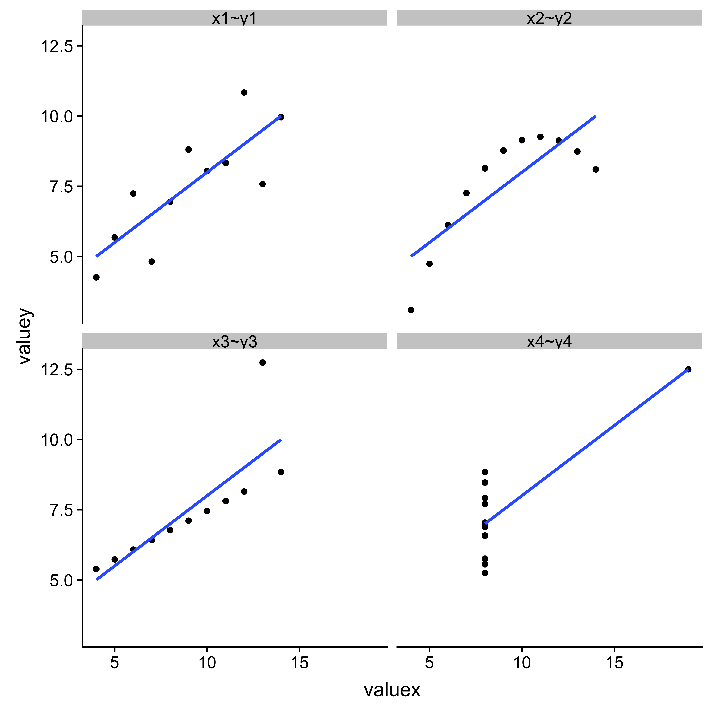
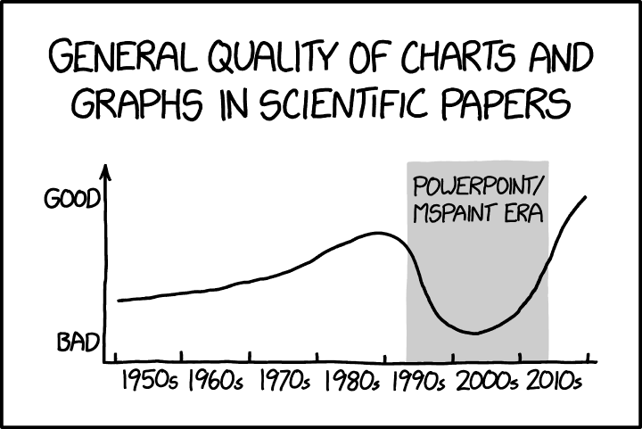
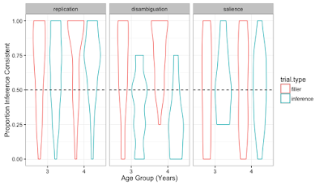
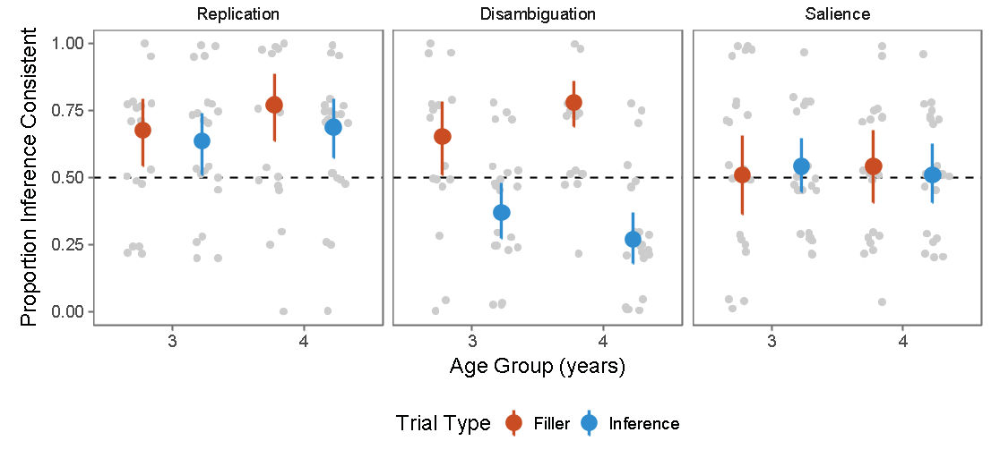
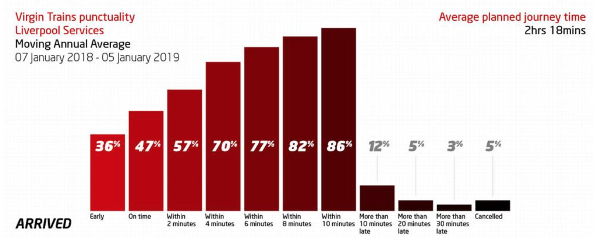

```{r setup, include=FALSE}
knitr::opts_chunk$set(echo = TRUE)
```

```{css echo=FALSE}
.goog-tooltip {
    display: none !important;
}
.goog-tooltip:hover {
    display: none !important;
}
.goog-text-highlight {
    background-color: transparent !important;
    border: none !important; 
    box-shadow: none !important;
}

```

---

### Worksheet translations available

Disclaimer: may not be very accurate...

<div id="google_translate_element"></div>

<script>

function googleTranslateElementInit() {

new google.translate.TranslateElement({

pageLanguage: 'en'

}, 'google_translate_element');

}

</script>

<script src="//translate.google.com/translate_a/element.js?cb=googleTranslateElementInit">

</script>

---


# Learning outcomes {.unnumbered}

At the end of the day you should be able to:

1. Explore a dataset in an informative manner

2. Make informed choices about how best to present data clearly and accurately through visualisations

3. Use the ggplot2 package to produce visualisations of data

4. Customise your visualisations so they look awesome to you and your audience

5. Reap the benefits of using R to quickly modify, update, and reproduce your visualisations

-----

# Conceptual building-blocks

## The joys of data

As technology and methods in the field of lingustics develops, the researcher is rapidly responsible for more and more data. This is ultimately a resource, not a hinderence, but requires the researcher to handle and understand that data better.

For example, if you are interested in analysing data from Twitter, the data one tweet produces is not simply the text of the tweet, instead there are an abudance of additional bits you are given. Although you may not be interested in using all of this data, it is important to remain close to the data you are using and not be detached from it.

From yesterday, you would have learnt how to wrangle data and get it in a shape that is usable for the next steps of data analysis in R. We will continue along this path, still using the __Tidyverse__, but today we will focus on data exploration and visualisation.


## Data exploration

It is always a good first step, once your data has been tidyed, to explore that data in some way. It is __never__ a good idea to jump straight into analysing a dataset you have not explored. This is part of getting to know your data. Imagine a situation where I give you a coffee cup but do not say anything else... would you go straight ahead and drink from it? You might ask basic questions first, what is inside, how was it made, is it alright to drink, is there anything wrong with it etc.

These same sort of questions should be asked when you have got your data, what does the data look like, how is it structured, is there anything that is wrong with it etc.


## Data visualisation

When getting to know your data, it might be intuitive to look at basic descriptive statistics, that provide summaries of your variables. But sometimes your data may require visualition to assist in this process, particularly when you have lots of data to work with. As we will see, data visualisation allows you to produce informative representations of your data, providing useful insights and observations that may not be possible from summaries alone. This is a key step to knowing your data better and can often help guide you in the next stages of analysis. These types of visualisation are primarily for you, do not always need to look fancy, but instead inform you in ways not always possible by just looking at numbers.

As the range of options available to visualise your results in different ways grows, you will be faced with decisions that need to be made about how best to present your final analyses. This means considering an audience that you may never encounter, but who need to understand clearly (and sometimes quickly) what it is you are trying to show. Thus, having a suitable and decent visualisation can often make a big impact on your poster/thesis/publication.

## Load in library

We will continue using the `tidyverse` to explore and visualise data, to do so we need to do the following:

Tell `R` that we want to use the `tidyverse` package... If this loads with no problems, you do not have to do anything else just now

```{r}
library(tidyverse)

```

# 1. Principles of data exploration

When you have gone through the process of collecting all of your data, have followed the excellent advice regarding data wrangling (from yesterday), the next step will be to explore your data and make decisions about what your next steps might be in your workflow.

One approach would be to get summary statistics of your data, for example the mean, standard deviation, correlations etc. that can be used as numeric sumamries.

Here is an example of how we might do this:

We will use the `anscombe` dataset:

First let's have a look at the data, run the following line of code.

Note that there are 11 rows and 4 columns in this dataset, you can see the last row by clicking on the _next_ button at the bottom.

```{r}
anscombe

```

The column names may not be very informative and the data just looks like a lot of numeric values.

Suppose that we are interested in exploring this dataset, specifically we want to know if any of the variables might be related in some way to each other, for example the _x1_ variable with the _y1_ variable.

Using your `dplyr` skills from yesterday...

<div class = "blue">
__Q.__ First, before running the code, identify what the following line of code should give you:
</div>

```{r}
anscombe %>%
  select(x1, y1) %>%
  summarise(mean_x1 = mean(x1),
            mean_y1 = mean(y1))

```

This tells us the mean for the variables __x1__ and __y1__, but it is not very informative...

Now let us get some information about the spread of the data...

We can do this by adding additional `funs` or _functions_ to our `summarise_all` argument.

Here we will change the `summarise_all(mean)` part of the code, so that it reads `summarise_all(funs(mean, sd))`

<div class = "blue">
__Q.__ What statistic will this add to our output?
</div>

```{r}
anscombe %>%
  select(x1, y1) %>%
  summarise(mean_x1 = mean(x1),
            mean_y1 = mean(y1),
            sd_x1 = sd(x1),
            sd_y1 = sd(y1))

```

Great, now we have both the __mean__ and the __standard deviation__ of the 2 variables, but we still don't really know much about the relationship between the two...

Let us get a correlation for the two variables.

```{r}
anscombe %>%
  select(x1, y1) %>%
  summarise(correlation_x1_y1 = cor(x = x1, y = y1))

```

The correlation we get is __0.816__... this is quite a strong correlation coefficient and suggests that the two variables are strongly related to one another.

Let's see if another pair of variables are also correlated...

<div class = "blue">
__Q.__ Get the mean and standard deviation for the variables __x2__ and __y2__.

__Q.__ Get the correlation coeffecient for the variables __x2__ and __y2__.
</div >

```{r}
anscombe %>%
  select(x2, y2) %>%
  summarise(mean_x2 = mean(x2),
            mean_y2 = mean(y2),
            sd_x2 = sd(x2),
            sd_y2 = sd(y2))

anscombe %>%
  summarise(correlation_x2_y2 = cor(x = x2, y = y2))

```

<div class = "blue">
__Q.__ Is there anything interesting you notice about the values from __x2__ and __y2__?
</div >

<div class = "green">
Hint: Go back and look at the values from __x1__ and __y1__
</div >

<div class = "blue">
__Q.__ Modify the code to get the mean, sd and correlation coefficients for __x3__ and __y3__, as well as __x4__ and __y4__

__Q.__ Is there anything interesting?

__Q.__ What does this tell you about the variables?
</div>

<br />

If we know the following are true for all the variables in the dataset:

* x mean = 9
* y mean = 7.5
* x sd = 3.316
* y sd = 2.032
* correlation coefficient = 0.816

<div class = "blue">
__Q.__ On a piece of paper, draw what you think the raw data should look like for each of the __x__ and __y__ relationships.

i.e. draw 4 separate plots, but don't look at the raw data!

__Q.__ Now look at the raw data... is there suprising? (you can do this by typing `anscombe`)
</div>



This is known as Anscombe's quartet, a carefully designed dataset, where all the mean, sd and correlations are all the same, but when you plot the data visually, you see a very different side to the data. This really highlights the importantance of not simply relying on a quick check of the descriptives, you can gain a lot from a visualisation, even showing things that may not be clear from just the numbers.

Whilst this dataset was indeed carefully designed, it highlights an important part of the data exploration process, i.e. making you question what is inside your data.

There have been instances where researchers have not taken these basic steps and have reported results in a way that may not be a faithful representation of the data...


<div class = "blue">
__Q.__ Look at `x3~y3`... if you removed the outlier, how would this affect the correlation?

__Q.__ Now look at `x4~y4`... if you removed the outlier, how would this affect the correlation?
</div>

<div class = "green">
__Tip.__ Have a look at the Datasaurus dozen for more Anscombe's quartet style examples https://www.autodeskresearch.com/publications/samestats


</div>

# 2. Principles of data visualisation

## The (R)evolution of the figure

Throughout the history of science, researchers have used visualisations to represent their results in a range of ways. With the development of technology, we no longer need to rely on pen and paper to produce scientific figures, instead we can utilise computers to do the hard work for us.

However, this does not mean that we can let the computer do all the work for us, producing an informative, interpretable and accurate visualisation can sometimes be challenging, requiring you to make certain choices, but getting it right can really impact upon how somebody reads and understands your work.

Be cautious though, those choices you make when producing your visualisation may also lead to visualisations that are actually not useful...



## Design principles

Three key design principles to think about when creating visualisations for others:


1. __Accessibility__

  * Is there too much information in one single figure?
  * Can labels, axes and annotations be read clearly and quickly?
  * Can a reader extract the message your visualisation is trying to tell?
  * Have you used the most suitable type of plot?
  * Can important comparisons be made across variables?






<br />


2. __Accuracy__

  * Are there any mistakes?
  * Have you included measures of variability e.g. 95% confidence intervals?
  * Are you axes scaled appropriately?
  * Is your presentation choice misleading the reader?
  * Have you avoided features that may highlight mistakes, e.g. no raw data points because of outliers?
    


<br />

3. __Aesthetics__

  * Have you made the most of the space avaiable?
  * Have colours been used effectively?
  * Is there too much whitespace?
  * Is the visualisation eye-catching?
  


# 3. Making your plots with ggplot

For the remainder of the session, we will focus on practically building visualisations using the `ggplot2` package. As with many things in R, there is a whole lot more you can learn to do once you have the basics, so today we will focus on building up your practical knowledge of a number of `ggplot2's` most commonly used features.

## Your first plot

Most of time when are making a ggplot visualisation, you will begin with by calling `ggplot()`...

```{r}
ggplot()

```

Note this is a useless plot...

It is no surprise that this plot is just blank, as you would have noticed, R relies on you to write useful lines of code in order to get what you want.

<div class = "blue">
__Q.__ Try retyping the `ggplot()` function again, but this time press the `tab` button when you are inside the brackets. What do you see?
</div >

<div class = "green">
__Tip.__ If you are not sure about any function in R, you can type `?ggplot` and run that line of code to get a help page, use this if you want more information about any of the different things we cover later on too.
</div >

Intuitively, one of most important parts of a `ggplot` is the need for some sort of `data` to plot

Let's try filling in this argument...

We will use the `anscombe` dataset again, so add `data = anscombe` inside the brackets.

```{r}
ggplot(data = anscombe)

```

Still a blank plot...

The next thing our plot needs is some information about what to plot from the dataset.

Lets try adding some more useful information...

Let's try and plot the `x1` and `y1` variables, so that `x1` is on the __x axis__ and `y1` is on the __y axis__.

This can be done by adding what `ggplot` calls an __aesthetic__, or `aes()` in code form...

<div class = "blue">
__Q.__ Add in an `aes()` argument to your `ggplot(data = anscombe)` code, specifying inside the brackets that `x = x1, y = y1`
</div >

```{r}
ggplot(data = anscombe, aes(x = x1, y = y1))

```

Great, we now have some sort of plot, not a very useful one still, but the _very very very minimum_ amount of information has been provided to get something out.

Lets store what we have as an __object__, we can do this by adding an __assignment__ to our code...

```{r}
my_plot <- ggplot(data = anscombe, aes(x = x1, y = y1))


```

Now, if we want to see our plot again, all we have to do is run the code `my_plot`

```{r}
my_plot

```


## Introducing layers and `geoms`

Notice that there is no real data being shown though, that is because we have not added any information about this part of the plot. There are lots of ways to visualise our `x1` and `y1` variables, but we need to specify this in our code...

The nice thing about `ggplot` is that it works through __layers__, this is a logical way to build up your plot - Imagine an artist working on a painting of a landscape...

* First, they have a blank canvas
* Second, they add in a background layer
* Third, a layer of background features
* Fourth, a layer of salient features
* Finally, being artistic and making it look a bit fancy

This is similar to how most visulisations are also designed, building up layer by layer.

`ggplot` predominantly adds in these useful layers through what it calls `geoms` or a _geometric object_. There are lots of `geoms` available in `ggplot`. They will normally have useful default settings, so you do not always have to specify every detail about your layer, as `ggplot` will do most of the work for you. We will return to this later, showing why you might want to modify none, some or all of the defaults to get your visualisation looking just the way you want.

In the next few sections we will introduce a few of the most useful `geoms` that `ggplot` has available, highlighting the different ways you can visualise different types of data.

## Two continuous variables

It is often useful to see how two variables are related to one another, we can show this relationship by using `geom_point` and `geom_smooth`, or a combination of both.

### `geom_point`

First, let's try a `geom` that plots our two variables in a __scatterplot__ - this seems like a sensible way to represent 2 continuous varaibles against one another.

<div class = "green">
__Tip.__ Imagine trying to plot two __categorical__ variables e.g. _favourite vowel_ with _first language_, using a scatterplot... it would not work.

__Scatterplots__ are most useful when you have __continuous__ (normally in the form of numeric) variables, e.g. reaction time or word frequency

Thus, a __scatterplot__ is really useful when visualising __relationships__ between __continuous__ variables.
</div >

<br />

In order to add the data points of our `x1` and `y1` variables, we need to add this layer to our previously written code, to do this we will use `geom_point()`

As this is a new layer to our plot, we will have to __add__ it on to our existing plot, this can be done in the following way...

```{r}
my_plot +
  geom_point()

```

Congratulations! You have produced a useful plot using `ggplot`.

<div class = "blue">
__Q.__ Add in a `geom_point` argument to your `ggplot(data = anscombe, aes(x = x1, y = y1))` code. Does this do the same as the `my_plot + geom_point()` code?

__Q.__ Using the longer version of your plot code, i.e. `ggplot(data = anscombe, aes(x = x1, y = y1)) + geom_point()`, modify the __aesthetics__ so you plot `x2` and `y2`

__Q.__ Once you have done that explore the rest of variables from the `anscombe` dataset, again changing the aesthetics
</div >

### `geom_smooth`

Instead of just having raw data points plotted in our scatterplot, we might be interested in seeing if there is a relationship between the two variables. One way we can do this is by adding in another layer to our plot.

`geom_smooth` is a particularly useful `geom` for this.

It will add a __fitted line__ to your data, representing a __trend__ between your variables of interest, e.g. to allow you to visualise a __correlation__ or __regression model__ (see the __tip__ below for more information).

Let's add to our previous plot by including `+ geom_smooth(method = "lm")`

```{r}
ggplot(data = anscombe, aes(x = x1, y = y1)) +
  geom_point() +
  geom_smooth(method = "lm")

```
 
 Great, you have now produced your next layer to the plot, which is letting you visualise the data in a more informative way.
 
 <div class = "blue">
 __Q.__ Try plotting a `geom_smooth(method = "lm")` but changing the __aesthetics__ to different `x` and `y` variables
 
 __Q.__ Do the lines look similar when you compare `x2` and `y2` etc.?
 
 __Q.__ Notice that we still have our raw data points in from the `geom_point` function, you can remove these by deleting that part of the code.
 
 Why is it useful to keep them in here though?
 
 __Bonus Q.__ Notice that there is a shaded region around the line, this represents the __standard error__ or `se`, where the more __narrow__ the `se` region, the less __variance__ there is in the data.
 
You can remove this by changing the `geom_smooth(method = "lm")` to `geom_smooth(method = "lm", se = FALSE)`.
 
 Why is it useful to keep in both the _standard error__ and `geom_point`? Hint, try the plot with the aesthetics `x4` and `y4`
 </div >
 
 
 <div class = "green">
 __Tip.__ Here we are using the `method = "lm"` argument to our `geom_smooth` function, this is basically to let R know that we want a specific type of line to be added to the plot, i.e. one from a linear model or `lm` for short, we will cover more on linear models and regression tomorrow, so don't worry too much if this sort of terminology is new to you. If you want to know more about `geom_smooth`, simply run `?geom_smooth` for the help page.
 
 Thus, `geom_smooth` is particularly useful when visualising __trends__ between __continuous__ variables, showing you the __direction__ and __magnitude__ of the trend
 </div >
 
## Categorical variables

Whilst plotting two continuous variables is useful, data is often more complicated, incorporating __categories__ i.e. groups that are not on a continuous scale, but are __discrete groups__, e.g. native language, vowel type, geographical region.

The types of variables have __levels__ which are independent from each other, e.g. possible levels for a geographical region variable would be, _Praha_, _Brno_, _Pilsen_, _Český Krumlov_ etc.

These types of variables will likely be something you are interested in investigating, with relation to your research questions, e.g. are there differences between the pronunciation of certain sounds in different areas of Czech Republic?

Let's have a look at how to compare the `x` values from the `anscombe` dataset, first we need to make a __long version__ of the x values, then a __summary data frame__ we can do this using `dplyr`. Run the code below to generate these two new datasets.

```{r}
anscombe_long_x <- anscombe %>%
  select(starts_with("x")) %>%
  pivot_longer(starts_with("x"), names_to = "x", values_to = "value")

anscombe_long_x

anscombe_summary_x <- anscombe_long_x %>%
  group_by(x) %>%
  summarise(mean= mean(value), sd= sd(value))
 
anscombe_summary_x

```

Now we have a long version - `ascombe_long_x` with __2 variables and 44 rows__:

`x` - a categorical variable, with 4 levels i.e. x1, x2, x3, x4

`value` -  the value of the x variable i.e. a number

We also have a summary dataset - `anscombe_summary_x` with __3 variables and 4 rows__:

`x` - a categorical variable, with 4 levels i.e. x1, x2, x3, x4

`mean` - the mean for each of the levels of `x`

`sd`- the standard deviation for each of the levels of `x`

### `geom_bar`

Let's plot the data from `anscombe_summary_x` in a __bar plot__ using `geom_bar`, with `x` on the __x axis__ and `mean` on the __y axis__.

Note: In `geom_bar()`, we need to include the `stat = "identity"` argument, this will ensure the bars represent the actual values in our `mean` varaible.

```{r}
ggplot(anscombe_summary_x, aes(x = x, y = mean)) +
  geom_bar(stat = "identity")

```

### `geom_errorbar`
This bar plot is pretty awful, it would help if we had some more information, e.g. the __standard deviation__, this requires adding an extra layer to our plot, which we can do with `geom_errorbar`.

Let's now add in the `sd` to each of the bars...

Note: We have to update the __aesthetic__ or `aes` of the plot in `geom-errorbar`, this will let us inform the `ggplot` code that we want to also plot some extra information, i.e. the top and bottom of the `sd`, we need to specify that the bottom of the errorbar `ymin` should be `mean - sd` and the top of the bar `ymax` should be the `mean + sd`

```{r}
ggplot(anscombe_summary_x, aes(x = x, y = mean)) +
  geom_bar(stat = "identity") +
  geom_errorbar(aes(ymin=mean-sd, ymax=mean+sd), width = 0.1)

```


We can also add in the raw data from `ascombe_long_x` using our `geom_point`...

Note: Again we need to update the arguments in `geom_point` to specify what __data__ we are plotting from, i.e. `anscombe_long_x` as well as the __aesthetics `aes(x = x, y = value)`

```{r}
ggplot(anscombe_summary_x, aes(x = x, y = mean)) +
  geom_bar(stat = "identity") +
  geom_errorbar(aes(ymin=mean-sd, ymax=mean+sd), width = 0.1) +
  geom_point(data = anscombe_long_x, aes(x = x, y = value))

```

<div class = "blue">
__Q.__ Why are bar plots on their own (i.e. without errorbars or raw data points) not a great way to represent the data?

__Q.__ What happens when you change the `width = 0.1` argument in `geom_errorbar`?

__Q.__ What happens when you change the order of the different `geom` layers

__Q.__ What else would you do to make this plot show the raw data points better?
<div />

### `geom_boxplot`

Bar plots are not always the most accurate or useful ways to visualise this type of data, instead we might be interested in using a __boxplot__.

We can save ourselves time too, as it only depends on the `anscombe_long_x` data.

```{r}
ggplot(anscombe_long_x, aes(x = x, y = value)) +
  geom_boxplot()

```
<div class = "blue">
__Q.__ What sort of data would a boxplot not be too suitable for?

__Q.__ Can you add a `geom_point` to the plot representing the __means__ from the `anscombe_summary_x` data?
</div >

<div class = "green">
__Tip.__ A boxplot has 5 imporant pieces of information, see https://ggplot2.tidyverse.org/reference/geom_boxplot.html for extra information about these.
</div >

### `geom_jitter`

It is not uncommon to have multiple data points at the same location on a plot. If we want to plot our raw data points, on for example a boxplot, we need to be aware of this, as we might be visualising the data in a way that is somewhat inaccurate if the points overlap...

Let's use `geom_jitter`, which is a neat solution to this issue. It will take a `geom_point` and ensure that the data is spread (or __jittered__) in a way that reduces overlapping datapoints.

```{r}
ggplot(anscombe_long_x, aes(x = x, y = value)) +
  geom_boxplot() +
  geom_jitter(width = 0.1, height = 0)

```

<div class = "blue">
__Q.__ What happens when you change the `width = 0.1` argument to `width = 0.5`? Which one is easiest to interpret?

__Q.__ You can change the `height` argument to the `geom_jitter` from 0, but why would this not be a good thing to do for our plot? Try it with `height = 5`.
</div >

### `geom_violin`

Another development on visualising our data is the __violin plot__ using `geom_violin`.

These are becoming more and more popular to represent this type of data as they show a bit more information than a boxplot...

```{r}
ggplot(anscombe_long_x, aes(x = x, y = value)) +
  geom_violin(draw_quantiles = c(0.25, 0.5, 0.75)) +
  geom_jitter(width = 0.1, height = 0)

```

<div class = "blue">
__Q.__ What are the differences between a __boxplot__ and a __violin plot__?
</div >

<div class = "green">
__Tip.__ For more information about violin plots, see https://ggplot2.tidyverse.org/reference/geom_violin.html.
</div >

# 4. Customising your visualisations

So far our visualisations have not looked particularly eye-catching, you might be thinking that you could probably make the same plots in excel/SPSS/Python... in this section we will look at the way you can really make your visualisations stand out, whilst also producing concise and readable representations of what can be quite complex datasets.

The nice thing about `ggplot2` is that almost every aspect of your visualisation can be modified, tweaked, personalised to suit you and your auidence. This means your code will likely get longer and more complex, but the output will be really impressive!

Let's work with a more interesting dataset than `anscombe`, you can read in data from a fake experiment that has been created for the workshop, pretend this is what the researcher is interested in...

We can load in the dataset from by running the following code:

Note: Information about the variables in the green box below.

```{r}
word_learning <- read.csv(url("https://raw.githubusercontent.com/jamesbrandscience/LASS_workshop_ggplot2/master/Data/Word_learning.csv"))

word_learning

```

<div class = "green">
  * __Research question__:

How does the number of years spent in NZ impact on the number of Māori words you can learn over the course of a short Māori language course?

  * __Dependent variable__:

number_of_words - Number of words learnt (continuous numeric)

  * __Independent variables__:

days - Number of days into the course (continuous numeric)

years_in_NZ - Number of years the participant has lived in NZ (categorical, 1, 2, 3, or 4 years)

age_group - Whether the participant was old or young (categorical)

  * __Random variables__

participant - The participant ID (categorical)

</div >

<br />

Now let's visualise the data...

## `Colour`

First we will plot:

`days` on the __x axis__

`number_of_words` on the __y axis__

add a `geom_smooth(method = "lm")`

Also...

Make different `geom_smooth` lines for our `years_in_NZ`, we can do this by adding in `colour = years_in_NZ` to our `aes`

```{r}
ggplot(word_learning, aes(x = days, y = number_of_words, colour = years_in_NZ)) +
  geom_smooth(method = "lm", na.rm = TRUE)

```

<div class = "green">
__Tip.__ The `method = "lm"` part of the geom_smooth indicates you want to plot a linear model (i.e. a simple regression), this is not a linear mixed-effects model visualisation. Be extremely cautious if you present your visualisations using this method, but your quantitative analysis uses a different method.

If you leave plot using `geom_smooth()` and do not add a `method = ` argument, you might get a plot that uses the default method (usually a `loess` smooth). Again, if your analysis does not use this method you should not be presenting your data with this method.

See [this post](https://stackoverflow.com/questions/31075407/plot-mixed-effects-model-in-ggplot) for more information on plotting lmer results.

</div >

## `geom_line`

Now let's add in some raw data...

Instead of using `geom_point`, we can use `geom_line` to track how `number_of_words` changes over time.

Note: We need to add an `aes` to the `geom_line`, here we will use `group = participant` to specify that we want lines to be drawn for each participant.

```{r}
ggplot(word_learning, aes(x = days, y = number_of_words, colour = years_in_NZ)) +
  geom_line(aes(group = participant)) +
  geom_smooth(method = "lm", na.rm = TRUE)

```

This looks a bit messy and noisy, making it difficult to see the actual results...

## `alpha`

Let's change the code to incorporate an `alpha`...

`alpha` is a really useful way to make less important layers less salient, it works as a __transparency__ argument.

Note: `alpha` goes outside of the `aes` argument.

```{r}
ggplot(word_learning, aes(x = days, y = number_of_words, colour = years_in_NZ)) +
  geom_line(aes(group = participant), alpha = 0.2) +
  geom_smooth(method = "lm", na.rm = TRUE)

```

## `facet`

Let's now see how the results vary based on `age_group`...

The visualisation is already incorporating quite a lot of information, so adding in another variable without overcomplicating things could be challenging.

A `facet` is a really nice way to __split__ your visualisations into separate plots, instead of having everything in one noisy plot. It also acts to __quickly divide__ you datasets so you do not have to generate multiple plots manually.

We can do with one simple layer using `facet_wrap`.

Note: We can facet more than one variable, but for now we will just focus on basic facetting.

```{r}
ggplot(word_learning, aes(x = days, y = number_of_words, colour = years_in_NZ)) +
  geom_line(aes(group = participant), alpha = 0.2) +
  geom_smooth(method = "lm", na.rm = TRUE) +
  facet_wrap(~age_group)

```

## `themes`

If we want to change background features of our visualisation, this can be done by choosing a `theme`. These can be peronalisaed so that you have complete control over almost all aspects of the way you plot looks, or for quick aesthetic changes, the defaults act as a neat solution to make things go from nice to _awesome!_

Let's add in a `theme` to the end of our previous plot, specifically using `theme_bw()`...

```{r}
ggplot(word_learning, aes(x = days, y = number_of_words, colour = years_in_NZ)) +
  geom_line(aes(group = participant), alpha = 0.2) +
  geom_smooth(method = "lm", na.rm = TRUE) +
  facet_wrap(~age_group) +
  theme_bw()

```

<br />

<div class = "blue">
__Q.__ What has changed just by adding this small additional line of code?

__Q.__ Try changing the `theme_bw()` line to `theme_dark`... when would this plot be appropriate?
</div >

## Bonus: `wordcloud`

For those who are working with text data...

A __wordcloud__ offers a snapshot visualisation of the text in dataset. These are normally used to represent __frequencies__ and certainly look more readable than a long table.

To make a __wordcloud__ in `ggplot`, we will need to use an extra package called `ggwordcloud`...

```{r}
#install.packages("wordcloud")
library(wordcloud)

```

Now we need a dataset...

For fun... I have mined the text in this tutorial so far and made it into a mini corpus with frequency counts of each of the words used. We will use this dataset to make a __wordcloud__.

<div class = "green">
__Tip.__ To see how I did this in `R` go to this tutorial: http://www.sthda.com/english/wiki/text-mining-and-word-cloud-fundamentals-in-r-5-simple-steps-you-should-know
</div >

<br />

Let's load in the data and see what it looks like...

```{r}
wordcloud_data <- read.csv(url("https://raw.githubusercontent.com/jamesbrandscience/LASS_workshop_ggplot2/master/Data/wordcloud_data.csv"))

```

It has 2 variables:

`word` - The word from the tutorial

`freq` - The frequency count of the word, i.e. the higher the number the more frequent

Let's visualise this dataset to see which __words__ have the highest __frequency__

```{r}
wordcloud(words = wordcloud_data$word,
          freq = wordcloud_data$freq,
          min.freq = 5,
          max.words=200,
          random.order=FALSE,
          rot.per=0.35, 
          colors=brewer.pal(8, "Dark2"))

```

<div class = "blue">
__Q.__ Can you understand the code that I used to generate this visualisation?

__Q.__ Use you `dplyr` skills to make a new dataset that removes the words __"let's", "visualise", "data"__ 
</div >


Great!!


<!-- ## More complicated visualisations -->

<!-- Moving beyond the `anscombe` dataset, we of course will have much more varied, noisy and larger data to visualise, often looking at more than just 2 variables of interest. Indeed many of the examples covered so far are primarily used to get to know your data a bit better, i.e. finding out about simple trends, distributions, outliers. -->

<!-- Next, we will take a look at richer visualisations that hopefully go a bit further... -->

<!-- ### Interactions -->

<!-- Visualising an interaction between 2 variables is a really helpful way to show what your statistical analyses represents. -->


<!-- Let's use a new dataset and see how we can make a scatterplot incorporate a categorical variable. -->


<!-- Research question: How does familiarity with Māori culture affect Māori word recognition, in who live in NZ, UK, US? -->

<!-- Dependent variable: Word recognition score (0-100) -->
<!-- Independet variables: Familiarity with Māori culture (0-100), Country (NZ, UK or Aus) -->
<!-- N participants: 100 (50 NZ and 50 Aus) -->

<!-- ```{r} -->
<!-- set.seed(100) -->
<!-- data <- tibble( -->
<!-- Word_recognition_score = c(rpois(50, 70), rpois(50, 40))) -->
<!-- data$Familiarity <- data$Word_recognition_score + rpois(10, 5) -->
<!-- data$Country = c(rep("NZ", 50), rep("Aus", 50)) -->

<!-- view(iris) -->

<!-- data <- iris[,c(1,2,5)] -->
<!-- names(data) <- c("Word_recognition_score", "Familiarity", "Country") -->

<!-- ggplot(data, aes(x = Word_recognition_score, y = Familiarity, colour = Country)) + -->
<!--   geom_point() -->
<!--   #geom_smooth() -->


<!-- ggplot(iris, aes(x = Sepal.Width, y = Sepal.Length, colour = Species)) + -->
<!--   geom_point() -->
<!--   #geom_smooth() -->

<!-- view(anscombe) -->

<!-- sample(c(1:100), size = 100, replace = TRUE, prob = c(0.1, 0.5, 0.4)) -->
<!-- ``` -->


<!-- We will need to __install the `gapminder` package__ -->

<!-- ```{r} -->
<!-- install.packages("gapminder") -->
<!-- require(gapminder) -->
<!-- ``` -->

<!-- First, let's see the dataset we are going to use, type `?gapminder` in the code block below and run it. This will give you some basic information about the dataset, you can also just type `gapminder` and the dataset will appear below. -->

<!-- ```{r} -->
<!-- ?gapminder -->

<!-- gapminder -->
<!-- ``` -->

<!-- Let's say we are interested in answering a research question - what is the relationship between __life expectancy__,  -->

<!-- gapminder -->

<!-- iris -->

<!-- ggplot(gapminder, aes(x = lifeExp, y = gdpPercap, colour = continent)) + -->
<!--   geom_point() -->

<!-- starwars -->
<!-- ``` -->


 
 
 
 
 
 
 
 
 
 
 
 
 
 
<!-- ## `geom_density` -->

<!-- When we have __one continuous__ variable, it might also be worth exploring the data through a __histogram__. These are really useful to show __the distribution__ of your raw data. -->

<!-- Let's make a new `ggplot`, looking at just one of our variables - `x4` with a `geom_histogram`. -->

<!-- ```{r} -->
<!-- ggplot(data = anscombe, aes(x = x4)) + -->
<!--   geom_histogram(bins = 2) -->

<!-- ``` -->

<!--  <div class = "blue"> -->

<!--  __Q.__ What does this suggest about the distribution of values in the variable `x4`? -->

<!--  __Q.__ Try looking at  -->


<!-- ### Adding in categorical variables -->

<!-- ### `geom_bar` -->

<!-- The `anscombe` dataset is interesting because it highlights the fact that even though summary statisticscan can look clear, e.g. looking at the mean, a visualisation of the data can uncover important underlying features that you might want to know about e.g. outliers. -->

<!-- Sometimes however, a visualisation may not always give you the full story about your data either. -->

<!-- We will use a __bar plot__ to plot data from a new dataset. -->

<!-- ```{r} -->
<!-- data <- tibble( -->
<!--   RT = c(rnorm(99, 100, 10), 150, rnorm(40, 50, 10), rnorm(60, 125, 10)), -->
<!--   Group = c(rep("A", 100), rep("B", 100)) -->
<!--   ) -->

<!-- data -->

<!-- info <- data %>% -->
<!--   group_by(Group) %>% -->
<!--   summarise(Mean = mean(RT), -->
<!--             SD = sd(RT), -->
<!--             SE = sqrt(sd(RT)/length(RT))) -->

<!-- info -->

<!-- ggplot(info, aes(x = Group, y = Mean, fill = Group)) + -->
<!--   geom_bar(stat = "identity", position = position_dodge(), -->
<!--            colour = "grey30") + -->
<!--   geom_errorbar( -->
<!--     aes(ymin = Mean - SD, ymax = Mean + SD), -->
<!--     width = .2, position = position_dodge(.9), size = 1 -->
<!--   ) -->

<!-- ggplot(data) + -->
<!--   geom_point(data, mapping = aes(x = Group, y = RT)) -->
<!-- ``` -->


<!-- ## `geom_density` -->

<!-- The `anscombe` dataset is interesting because it highlights the fact that even though summary statistics can look clear, a visualisation can uncover important underlying features in your data, e.g. outliers. -->

<!-- When we have __one continuous__ variable, it might also be worth exploring the data through a __histogram__. These are really useful to show __the distribution__ of your raw data. -->

<!-- Note we will only look at one variable for this visualisation. -->

<!-- ```{r} -->
<!-- ggplot(data = anscombe, aes(x = x1)) + -->
<!--   geom_histogram(bins = 20) -->
<!-- ``` -->


<!-- <div class = "blue"> -->
<!-- __Q.__ What happens when you add `bins = 4 -->
<!-- </div > -->

<!-- ## `geom_histogram` -->

<!-- We will now visualise __distributions__, this is different from the previous `geom` as we will be using a different combination of data - primarily -->

<!-- ```{r} -->
<!-- ggplot(data = anscombe, aes(x = x1)) + -->
<!--   geom_histogram() -->

<!-- ggplot(data = anscombe, aes(x = x1, y = y1)) + -->
<!--   geom_boxplot() -->
<!-- ``` -->


<!-- ## A more practical example... -->
<!-- Linguistic data often requires some criteria of outlier removal, determined a priori. -->

<!-- Imagine an experiment where you have collected reaction times from an experiment investigating lexcical decision performance, i.e. participants have to respond with a button press if they think the word is a real-word or a non-word. -->

<!-- Given the paradigm being used, some trials in the experiment may not be as expected, the participant might have had an itchy nose, coughed or got distracted, therefore we cannot assume all trials will be valid in the dataset. -->

<!-- One way to explore the data, would be to visualise it and look for irregular values e.g. using a boxplot -->

<!-- ```{r} -->
<!-- boxplot(diamonds$x) -->
<!-- ``` -->

<!-- This might tell you which values are the highest/lowest, but it is not a good idea to just decide that these values are outliers and should be removed. -->


