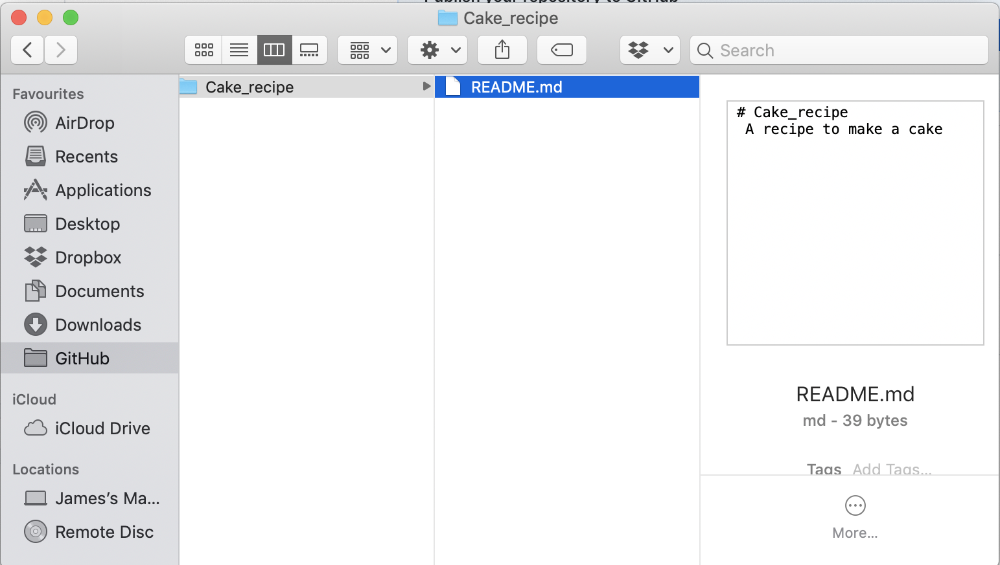

```{r setup, include=FALSE}
knitr::opts_chunk$set(echo = TRUE)
```

This worksheet aims to introduce Git and GitHub for those who have not used it before, but would like to try it out.

The main outcomes will be:

- Conceptual understanding of what Git and GitHub are
- How they can make your workflow more efficient
- Using GitHub
- Managng a repository and the changes you make
- Collaborating on projects
- Hosting your repositories on a cool website

#What is Git and GitHub

###Git {-}

Git is software that helps your computer keep track of files and their changes. It is called a `version control system` because it knows how your files have changed over time. Once installed, it will sit on your computer largely unnoticed. 

<!-- You can think of it as being similar to a car - in that it does very technical things that you do not need to worry about (e.g. how the engine works), but being able to use it can be very helpful (e.g. learning to drive). -->

Example: You are writing a recipe for a cake in a basic `.txt` file, when you start writing the recipe it might have things like _eggs_, _some flour_, _a bit of milk_. You save the file and make the cake. The next time you go to this file, you might _edit_ some of the old items, so your updated file might have _2 eggs_, _100g flour_, _100ml milk_. Git can now let you compare these two versions, without the need to have 2 separate files (not so good recipe 1 and slightly better recipe 2).

###GitHub {-}

GitHub is a (free) service where you can host your Git managed projects. It is similar to Dropbox (but with some big advantages) in that you need an account, then you can store your work in the 'cloud', letting you access it anywhere with an internet connection. There are other _flavours_ of this sort of service, such as `GitLab` and `BitBucket`, but we will focus on GitHub for now. It is well suited to let you collaborate with others, so the project files on your computer can be used by other collaborators, without having to send the files, let them edit it, send it back to you and so on.

Example: You put your cake recipe file on GitHub, you invite somebody to collaborate on this file (somebody who can bake a good cake), they can now access the files on their computer, make changes and _update_ your file, for instance adding _100g sugar_. When you come to use the file again, you can now access this updated version and have your old version update with the click of a button, whilst still being able to compare the two files easily.

###GitHub Desktop {-}

GitHub Desktop is a (free) app, it gives you a way to seamlessly integrate your local projects (ones saved on your computer) to GitHub (ones stored online), and vice versa. It can make the whole process of using Git a bit more user friendly. It is similar to RStudio, which we use as an interface to R, GitHub Desktop is an interface to Git and GitHub, allowing you to perform actions without having to deal with Git commands directly. It communicates the changes you make to files, allowing you to easily update and sync everything with a few clicks.

The more programmy users tend to use Git from a `shell`, see [here](https://happygitwithr.com/shell.html#shell) for more information, but I find this scary, so an app is much more comfortable for me and my (relatively basic) Git requirements.

# How they can make your workflow more efficient

If you use `Dropbox` or `Google Docs` or just your `hard drive` to store and manage your research projects, you might think using Git could be a lot of hassle for little reward. But here are some reasons you might find it useful:

- How often do you back up your projects to a secure online location? If you just rely on your computer or an external hard drive, these are normally dependent on you having an up-to-date version of your files to work on, which could be a problem if they break or can not be accessed (by you or your collaborators). You no longer have to deal with cluttered folders containing several versions of the one file. When you use Git you can back up files with just a click, even adding a description of what you have done since the last changes.


<!--  -->

- Git lets you have a `master` file that you and your collaborators can work on, making edits and changes whenever, but keeping just the one file and a `version history` so you can look back efficiently on what has changed.

- Google Docs is good for online collaboration of text documents, e.g. a manuscript, but what about the R code for your analysis? Or the large data file you have? The nice thing about Git is that it functions best for code development, not just text documents. This can be particularly useful when you are working on code that is very much work in progress, hence not having the scenario where you have `analysis_version_1.5.2other.R`.

- Dropbox offers some nice ways to track different versions, and allows you to use different file formats quite easily for storage, but Git has the added benefits of being community based. More and more researchers are using Git and GitHub to store their work, this means once you know how to use these tools, you can be a more active participant in this community. Hopefully, by the end of this tutorial you will learn how to interact with a whole world of public repostitories and see the wider appeal of GitHub over Dropbox.

- In my own opinion, the way Git makes you think about your workflow, organisation and general usability of your files is the reason I find it appetising. It can make collaboration, development and your computer all more efficient systems.

- **BUT...** it largely depends on the willingness of others to use and understand it.

#GitHub's workflow and terminology

Using GitHub will be a little bit different from how you might normally manage a project. So it is worth introducing some of the basic ways GitHub is used and what certain words _mean_.

Instead of just having a file, saving it, sending it to a collaborator, receiving their version and iterating through these steps, research projects tend to have multiple files (e.g. data, R code, manuscripts, figures), each of which will likely be subject to changes over the course of the project. Here is _one_ way a GitHub workflow might function:

###**Step 1:** Create your `repository` {-}

<mark>What is a repository?</mark>

A `repository` (or `repo`) is where all your project files belong.

If you have a folder on your computer called `PhD` and a sub-folder called `Experiment 1`, this sub-folder should be a repository and contain everything that is relevant to your `Experiment 1` project, e.g. more sub-folders called `data`, `analysis`, `write_up`. This also means not having important files located outside of the sub-folder, i.e. don't keep your socks in the kitchen. 

Repositories are the first step in the GitHub workflow, everything inside of the repository on your computer will be tracked by Git. Then when you are ready, you can publish the contents of the repository to your GitHub (cloud) version, updating it when you reach certain development milestones.

Note: Every repository is expected to have a `README.md` file.

<mark>What is a README.md file?</mark>

This gives anybody who is accessing your repository a reference point to go to, it should clearly explain what the repository is for, what it contains, and any other important information to help you or anybody else understand more about it.

The `.md` stands for `markdown`, a simple file format for simple text documents. See [https://en.wikipedia.org/wiki/Markdown](https://en.wikipedia.org/wiki/Markdown) for more details.

Below is an example of a local repository (i.e. one on your computer).


###**Step 2:** Commiting changes {-}

<mark>What is a commit?</mark>

If you are working on a file, you will likely save that file many times whilst working on it. Once the file gets to a stage that you want a version officially stored, you have to `commit` it. Think of this as "I have done a lot of work on this file and it is at a stage that I am happy with for now", at this point you would `commit` to having that version stored by Git. It is like a formal announcement of your willingness to store that version.

Therefore, `commits` are different to just saving the file as you go along, it is like reaching a milestone in the development of the file, e.g. you managed to get your mixed-effects models working for your Experiment 1 analysis.

Every `commit` you make has to be accompanied by a description, which tells you and anybody else what that commit was for, e.g. 'Working lmer code', these are a helpful way for you to understand the project as it develops.

Making a `commit` does not have to relate to just one file in your repository, for example if you have written the code for your analysis and added nice plots to your repository, these changes can all be under a single `commit`.

###**Step 3:** Pushing changes {-}

<mark>What is pushing?</mark>

You might make several `commits` before you are ready to actually publish those changes to your GitHub version of the repository, when you are ready to do this, you `push` them. Think of this as you making changes to the files on your computer, you have made some commits, but now your supervisor needs to see what you have been working on and edit the files. When you are ready for your computer based (local) version to go out to GitHub, you need to push them. They will still be on your computer, but now the version you pushed will be stored on GitHub.

###**Step 4:** Fectching changes {-}

<mark>What is fetching?</mark>

Once you have pushed your changes to GitHub, they can now be accessed by your collaborators or you on a different computer. Collaborators can have a version on their computer by `fetching` it from GitHub and can make changes themselves. They can then commit their changes and push them back to GitHub.

###**Step 5:** Branches for changes {-}

<mark>What is a branch?</mark>

So far, we have only thought about a linear workflow, where you commit, push and fetch as your project develops - this is all done on what GitHub calls the `Master` branch, i.e. one main version of the repository which is undergoing changes by you and your collaborators.

But what if you want to make exploratory changes that do not affect this `Master` version? You can create a new branch! This will come off from the `Master` and allow you to modify as much as you want (still commiting, pushing, fetching), but without it affecting your safe `Master` version.

Think of this in terms of the cake recipe file. You have a cake recipe that is good, so you have it in your `Master` branch, but what if you want to try experimenting with the recipe by using `vegan butter` instead of normal `butter`? You can make a new branch (branches are normally given names, so in this case it might be `vegan_branch`), try the changes and:

- **Option 1:** If you like those changes you can `pull` them back into the `master` branch (see next step)
- **Option 2:** If you don't like them, then your vegan butter recipe can sit on that branch without anybody ever needing to know about it

###**Step 6:** Pulling changes {-}

<mark>What is pulling?</mark>

When working on a branch, you might eventually think the work is great and want to incorporate it back into the `Master` branch again. Or alternatively, your collaborator is working on a branch and thinks their changes should be included in the `Master` version. In order to do this, you need to submit a `pull request`, which is basically the GitHub way to say 'here are some useful changes, do you approve?'.

After you have reviewed the changes, pondered over them, you can then decide to `pull` and `merge` the changes into your `Master` branch, or leave them on the development branch. This is done by Git understanding how the `Master branch` and the `pull request branch` differ, then by some Git magic incorporating the changes

<!-- Depending on who administers the repository will depend on who gets to approve the `pull requests`. This is a bit advanced for this tutorial, but it is worth knowing about. -->

###**Other terminology** {-}

- **Cloning**<br/>
If you see a repository on GitHub you like/want, you can `clone` it to your computer, essentially saving everything you see to your computer

- **Forking**<br/>
This is similar to `cloning` but when the repository is updated, your computer version will update too

#Using GitHub

---

**\*\*\*Please do these steps prior to the session if possible\*\*\***

---

For a more comprehensive tutorial on these steps, as well as Git and GitHub more generally, see:

- [GitHub's help page](https://help.github.com/en/articles/signing-up-for-a-new-github-account)

- [Jenny Bryan's tutorial](https://happygitwithr.com/github-acct.html)

- [Danielle Navarro's tutorial](https://github.com/cskemp/chdss2018/blob/master/day2_dataanalysis/git-notes.md)

- [Daniel van Strien's tutorial](https://programminghistorian.org/en/lessons/getting-started-with-github-desktop#register-for-a-github-account)

###Getting a GitHub account {-}

To use GitHub you need to have an account.

Go to [https://github.com/join](https://github.com/join) and follow the steps.

It is worthwhile to sign up using your `@canterbury.ac.nz` email address, this will let you access GitHub Education benefits (I think), but we can come to that another time.


<!--  -->

###Installing GitHub Desktop {-}

Once you have an account, you can now download the GitHub Desktop app from:

[https://desktop.github.com](https://desktop.github.com)

Once you have installed it, it will ask you to `Sign into GitHub.com`, click this option and input your username and password.


###Installing Git {-}

To my knowledge, installing GitHub Desktop should also install Git for you.

But this may be an older version of Git, so if you get keen and want to use a shell to manage your Git projects, you might want to install a more recent version, if so you can download it at [https://git-scm.com](https://git-scm.com). As we are focussing on the basics in this tutorial, the GitHub Desktop version should be fine.

<!-- - **Easy option (Mac)**<br/> -->
<!-- In GitHub Desktop, go to GitHub Desktop in the top bar and cick `Install Command Line Tool`<br/><br/> -->
<!-- If you see a message saying `The command line tool has been installed at...` you already have Git installed. -->

<!--  -->

#Your first GitHub repository

Now you have an idea of what Git and GitHub do, let us use GitHub Desktop to do some of those things.

We will:

- Create a repository for a cake recipe
- Add a `.rmd` file to that repository
- `commit` the changes
- `edit` the `.rmd` file to make it a bit better
- `commit` again and `push` the changes to GitHub

###**Step 1:** Creating a repository {-}

As a first step let us create a folder to store our GitHub projects in...

**Create a new folder called `GitHub` somewhere sensible on your computer**

Then, in GitHub Desktop, click `File` - `New Repository...`


Then, fill out the information box, see image below (don't forget to tick the `Initialize this respository with a README` box)


If we check in our `GitHub` folder, there should now be a new folder called `Cake_recipe`, with a file called `README.md`



If we go back to GitHub Desktop, we can now `publish` our repository to our GitHub by pressing the `Publish repository` button


Fill out the information so your repository has a name and basic description...


Once this is done, we can now see our repository on GitHub by clicking on the `View on GitHub` button

Ta da...

Your first (pretty awful) repository is live and living on the GitHub


###**Step 2:** Adding files, commiting and pushing {-}

As this is a pretty awful repository, we need to add something to it...

Let us add an `.rmd` file with a cake recipe in, you can do this in RStudio by going to `File` > `New File` > `R Markdown`

Then write a recipe like the one below

Then, **save the file in your `cake_recipe` folder**


If we go back to GitHub Desktop, we will now see something interesting has happened...


Git has realised you have added a new file to your folder (local repository) and that is why you see lots of green...

Let us `commit` this new change as it feels like a milestone...

In the bottom left corner, there will be a little box that looks like the one below, add a title and description to your commit, then click the `Commit to master` button


Before we `push` this to GitHub, let us go back to the `.rmd` file and make another change, make sure you `save` the file again...


Now, return to GitHub Desktop, you will see it has again noticed your changes, this time there is red and green...

The red text is the part of the file that has been modified, the green part is for the changes you have made, cool!

**Write another `commit` message and `Commit to master` again**


Now we are ready to `push` these changes...

Click on the `push to origin` button and then after it is complete, your update will be live on GitHub


###**Step 3:** Adding a collaborator and pulling {-}

This still a pretty bad cake recipe, so maybe we need some help...

We can add a collaborator to the repository who will be able to access and edit the files and improve our recipe hopefully

In GitHub Desktop click on the `View on GitHub` button again, which should open up the repository in your web browser

Once you are there, click on the `settings` button


From here you can click on the `Collaborators` button located at the side, if you know the GitHub username of the person you to collaborate with enter it in the box and then click the `Add collaborator` button, which will send them an invite...

As Dan is such a good baker, I want him to help out with this recipe


When Dan accepts the invite, he can now edit the files...

He has changed our `cake_recipe.rmd` file, but to see these changes we need to `fetch` them...

Click on the `fetch origin` button in the centre of the top panel of GitHub Desktop (where it says `Pull origin` in the image below), this will `fetch` the changes made by Dan

Once these have been fetched, we can click on the `pull origin` button, which will update the files on your computer


Ta da...

If we now open the `cake_recipe.rmd` file in RStudio, we can see the updated recipe from Dan


#Bonus: GitHub Pages

One of the great things about GitHub is that you can host your files online. This is particularly useful when we have `.html` files from an `.rmd` document. Instead of sending the raw file out to people, who then have to download and open it, you have it on a personal GitHub site page url, meaning all you have to do is click to access it.

The really nice thing about this is that when you push your changes to your GitHub repository, that `.html` file, which will be on a url, will be updated too!

To do this we can generate a `.html` of our `cake_recipe.rmd` file

In RStudio, navigate to the `cake_recipe.rmd` file and click on the `knit` button

In our folder there should now be a file called `cake_recipe.html`

As this is a Git folder, we should `commit` the changes and `push` them to GitHub

Return to the repository on GitHub.com and click on the `Settings` button again

Scroll down to where it says `GitHub Pages`

You will need to change the `Source` to allow your repository to be hosted as a GitHub Pages site

Where it says `None`, change it to `master branch`

This will refresh the page and now your repository has a cool url


If you click on the blue link though, you will get a 404 error, this is because there is not actually anything useful at this site...

But we do have a `.html` file in our repository, lets try adding `Cake_recipe.html` to the end of the url (or whatever your `.html` file was called)

Now we should be able to view it on the internet!


This is exactly how this tutorial is being hosted, as a file in a GitHub repository, that I am editing on my laptop, comitting changes, pushing the changes and hosting it as a GitHub page.

If you notice any spelling issues, want to make this tutorial better,  please let me know and I will add you as a collaborator!


