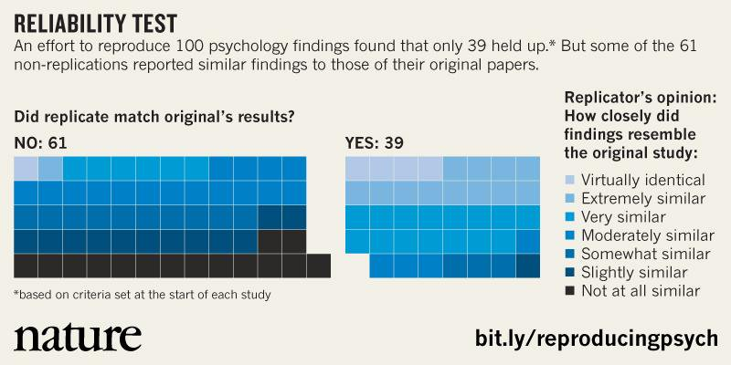

```{r setup, include=FALSE}
options(htmltools.dir.version = FALSE)
```

class: title-slide-final, center, middle
background-image: url("images/NZILBB.png")
background-size: 300px
background-position: 98% 2%

# Slides

<font size="12" color="white">https://tinyurl.com/NZLS-workshop</font>

---

# Outline

### .pull-left[
12.30-3.00pm<br/><br/>3.00-3.30pm<br/><br/>3.30-4.30pm<br/><br/>4.30-5.00pm</br></br>5.00-5.30pm
]
### .pull-right[
Introduction to Open Science<br/><br/>Afternoon tea<br/><br/>Open Science Framework</br></br>R communities<br/><br/>Linguist in the wild
]

---

.pull-left[

<br/>

# Who am I?

## • Linguist (quantitative)

## • Open scientist

## • Early career researcher

]

--

.pull-right[

<br/>

# Who I am not?

## • Expert statistician/data scientist

## • Expert open scientist

## • Dictator

]

---

class: title-slide-final, center, middle
background-image: url("images/NZILBB.png")
background-size: 300px
background-position: 98% 2%

# A quick survey

<font size="12" color="white">http://etc.ch/znsQ</font>

???

[http://etc.ch/znsQ](http://etc.ch/znsQ)

[https://directpoll.com/r?XDbzPBd3ixYqg8Yyl71VcRw9CeP4hGiDmylDb1SAa2](https://directpoll.com/r?XDbzPBd3ixYqg8Yyl71VcRw9CeP4hGiDmylDb1SAa2)

---

# What is Open Science?

## There are lots of definitions...

--

## In it's simplest form... just doing 'normal' science but more .NZILBBgreen[transparently]

--


--


---

# The times they are a changin'

<!-- </img> -->
.pull-left[

]

.pull-right[

]
<a href="https://www.nature.com/news/1-500-scientists-lift-the-lid-on-reproducibility-1.19970" style="position:absolute; top:600px; left:100px; color:#9DA756">Baker (2016)

<a href="https://acmedsci.ac.uk/file-download/38208-5631f0052511d.pdf" style="position:absolute; top:600px; left:620px; color:#9DA756">Academy of Medical Sciences (adapted)

???


---
# The times they are a changin'

.pull-left2[
### Publication models are evolving

### Making it easier to be open (online materials)

### Making it more beneficial to be open (citations)

### Making it more important to be open (funding)
]


<a href="https://www.nzlingsoc.org/journal/current-issue/" style="position:absolute; top:575px; left:650px; color:#9DA756">Te Reo
---

# What is this workshop about?

## The purpose of this workshop is to introduce you to .NZILBBgreen[some] of the ways you can be more open

--

## This can involve introducing .NZILBBgreen[small] changes to your .NZILBBgreen['normal'] workflow

--

## You don't have to do .NZILBBgreen['everything'] to be an open scientist

--

## If you find some things useful great! ... .NZILBBgreen[Give them a go!]

---

# Who is this workshop for?

## Everybody!

--

## Open Science should be .NZILBBgreen[fundamentally inclusive], everybody learns from each other

--

## If you have concerns/questions/criticisms of the things being discussed here, .NZILBBgreen[let us know]

---

class: title-slide-final, center, middle
background-image: url("images/NZILBB.png")
background-size: 300px
background-position: 98% 2%

# Concepts and definitions

---

</img>

<a href="http://oro.open.ac.uk/44719/2/kmi_foster_iknow.pdf" style="position:absolute; top:600px; left:100px; color:#9DA756">Pontika et al. (2015)

---

class: title-slide-final, center, middle
background-image: url("images/NZILBB.png")
background-size: 300px
background-position: 98% 2%

# 1. Replicability

---

# Replicability

## The ability to replicate the work of somebody else, using independently collected data, but derived from the same methods


<a href="https://www.awesomeinventions.com/cake-fails/" style="position:absolute; top:630px; left:100px; color:#9DA756">Hulk cake

---

# Replicability

## .NZILBBgreen[Example 1]

--

### <b>Claim:</b> Flipping a coin 5 times gives this sequence:<br/>heads, heads, tails, tails, tails

--

### <b>Method:</b> Flip a coin 5 times

--

### <b>Result:</b> heads, heads, tails, tails, tails

--

</img>

## .NZILBBgreen[Try to replicate it yourself]

<a href="https://en.wikipedia.org/wiki/Nature_(journal)" style="position:absolute; top:600px; left:800px; color:#9DA756">Brand (In press)

---

# Replicability

</img>

</img>

<a href="https://www.nature.com/articles/nature.2015.18248" style="position:absolute; top:600px; left:100px; color:#9DA756"> Baker (2015)

<a href="https://science.sciencemag.org/content/349/6251/aac4716.short" style="position:absolute; top:600px; left:700px; color:#9DA756"> Open Science Collaboration (2015)

---

# Replicability

## Why is it important?

<ru-blockquote style = "font-size:40px">"The scientifically significant physical effect may be defined as that which can be regularly reproduced by anyone who carries out the appropriate experiment in the way prescribed"<br/><p align="right" style = "font-size:30px">Popper (1952: 23-24)</p></ru-blockquote>

---

# Replicability (critiques and responses)

## Replications are not a good use of time and resources, they do not warrant publication

--

### Sure, they do take time and resources. If the original paper did not find the same result, would it have been published? Should we value .NZILBBgreen[null results] the same way as significant results?

--

## Who gets to decide which is the correct result?

--

### Nobobody. But perhaps it can .NZILBBgreen[stimulate discussion] between groups when different results are found and understand why that might be

---

# Replicability (critiques and responses)

## The replication did not give the same result... this is because the participants were too different

--

### Sure, there will be differences from the original sample. Can this be explained from a .NZILBBgreen[theoretical standpoint]? If so, was it mentioned in the original submission?

--

## The replication did not give the same result... this is because the experiment was not run correctly

--

### Sure, no replication will be exactly the same. Did the original submission give enough .NZILBBgreen[reproducible] information to run it correctly?

---


class: title-slide-final, center, middle
background-image: url("images/NZILBB.png")
background-size: 300px
background-position: 98% 2%

# 2. Reproducibility

---

# Reproducibility

## The ability to reproduce the work of somebody else by using the same methods, data and analyses, as was originally reported


<br/>
<a href="http://www.sciencecartoonsplus.com/pages/gallery.php">Harris (2019)

---

# Reproducibility

## .NZILBBgreen[Example 1]

### <b>Claim:</b> 70 + 45 x 1.22 = 124.9

--

### <b>Method:</b> Type 70 + 45 * 1.22 into a calculator

--

### <b>Result:</b> The calculator gives the value 124.9

--

</img>

<div<a href="https://gph.is/2CWu6gz" style="position:absolute; left:700px; top:500px">https://gph.is/2CWu6gz

---

# Reproducibility

## .NZILBBgreen[Example 2]

### <b>Claim:</b> People attending this workshop are statistically more awesome than people not attending this workshop

--

### <b>Method:</b> Asked 100 random people to rate on a scale of 1-10 how awesome workshop attendees and a sample of non-workshop attendess are

--

### <b>Result:</b> I ran a mixed-effects regression model, predicting awesomeness rating, with workshop attendance (attended or not attended) as the main effect, which was significant (p < 0.05)

---

# Reproducibility

## .NZILBBgreen[Example 3]


### <b>Claim:</b> Women are taller than men

--

### <b>Method:</b> Looked at various pictures of women and men in 3 different contextual settings

--

### <b>Result:</b> Women are taller than men p < 0.00001

--

</img>

<div<a href="http://datacolada.org/31" style="position:absolute; top:650px">http://datacolada.org/31

--

</img>

<div<a href="http://datacolada.org/31" style="position:absolute; top:650px">http://datacolada.org/31

--

</img>

<div<a href="http://datacolada.org/31" style="position:absolute; top:650px">http://datacolada.org/31

--

<div<a style="position:absolute; left:500px; top:100px; font-size: 50px; color: red">Just because it is reproducible,<br/>doesn't make it reliable evidence

---

# Reproducibility

## Small steps towards being more reproducible (we will revisit these later)

--

### Share your data, code, materials, anything that you have

--

### Ensure the things you share can be understood by others

--

### Don't manual edit data files (in Excel) then overwrite the master file

--

### Try to code, not click

--

### Idenitfy errors, don't hide them

---

class: title-slide-final, middle
background-image: url("images/hansel_gretel.jpg")
background-size: contain

???

The second time, Hansel lays a trail of breadcrumbs to follow home

---

# Reproducibility

## Ways being reproducible makes things easier (for myself)

--

### 1. It makes me more organised

--

### 2. It makes me understand what I have been doing

--

### 3. It makes me more confident

--

### 4. It (eventually) makes me more efficient

--

### 5. It makes me identify errors

---

# Reproducibility

## Ways being reproducible makes things easier (for others)

--

### 1. It allows others to understand your workflow

--

### 2. It allows others to learn

--

### 3. It allows others to pick up where you left off

--

### 4. It allows other to reproduce your work

--

### 5. It allows others to identify errors

---

class: title-slide-final, middle
background-image: url("images/Comic.png")
background-size: contain

<a href="http://www.phdcomics.com/comics/archive/phd031214s.gif" style="position:absolute; top:630px; left:100px; color:#9DA756">phd comics

---

---

class: title-slide-final, middle
background-image: url("images/NZILBB.png")
background-size: 300px
background-position: 98% 2%

# 3. Pre-registration

---

# Pre-registration

## The process of declaring key aspects of your research plan, prior to actually undertaking the research, using a time-stamped document

</img>

<a href="https://osf.io/prereg/?utm_source=cos_site&utm_medium=get_started_button&utm_campaign=PreReg_Challenge" style="position:absolute; top:600px">Open Science Framework pre-registration

---

# Pre-registration

## Why bother?

--

### <b>p-hacking:</b> when you decide to modify, change or adjust the original analysis approach to .NZILBBgreen[find] your p < 0.05 result

--

### <b>HARKing (Hypothesising After Results are Known):</b> when you decide to modify, change or adjust the original hypotheses to .NZILBBgreen[suit] your p < 0.05 result

--

## .NZILBBgreen[Pre-registration facilitates openness about what your original intentions were]

---

# Pre-registration

## .NZILBBgreen[p-hacking example]

### You generate a hypothesis

### You collect data from 15 participants to test the hypothesis

### You choose to look at the data and run your analyses

### The results are significant

### You think you should probably collect more data, but decide not to

---

# Pre-registration

## .NZILBBgreen[HARKing example]

### You generate a hypothesis

### You collect data from 50 participants

### You choose to look at the data and run your analyses

### The results do not support your hypothesis

### You change your hypothesis and generate a new one that suits the results

---

# Pre-registration

## p-hacking and HARKing are generally seen as not good practice

## They will likely result in studies that are low in power

## Or studies that do not have a strong theoretical motivation

## .NZILBBgreen[Pre-registering your studies, where you define your hypotheses, methods, analysis **BEFORE** running the study, will minimise the likelihood of these issues]

---

# Pre-registration

## Benefits?

## You .NZILBBgreen[formulate] your ideas from the outset

## It provides a .NZILBBgreen[time-stamped] version of your plan

## It allows .NZILBBgreen[others] to understand what you intended to do and why you chose to do it

## It is .NZILBBgreen[rewarding] when you plan works out, .NZILBBgreen[informative] when it does not

---

# Pre-registration

## If I pre-register, am I stuck with that plan forever?

### No. You can .NZILBBgreen[update] your pre-registration in response to the development of the project. Just try to avoid doing so after data collection

## If I pre-register, do I have to state a clear hypothesis?

### No. Hypotheses can be .NZILBBgreen[confirmatory], where you have a clear prediction about your results, or they can be .NZILBBgreen[exploratory], where you do not have a clear prediction about the results.<br/> .NZILBBgreen[Both are fine!] As long you specify in the first instance.

---

</img>

</img>

<a href="https://cos.io/prereg/?_ga=2.176235308.886825152.1574745813-1923398288.1574630497" style="position:absolute; top:600px">Centre for Open Science


---

# Pre-registration

## Does it have to be very detailed?

### No. You can add as much detail as you want. Just be clear and honest.

## Does it take long?

### No. They can be completed in a few minutes. Deciding what to pre-register might take longer, but that is the reason pre-registration is sensible... .NZILBBgreen[it lets you decide on what you are going to do]

---

# Pre-registration

## Is there a template?

### Yes. We will complete one in the next part of the workshop

## What if things don't turn out as I predicted?

### That is doing science! If your results don't match your expectations, .NZILBBgreen[that is the result to report], there will be a reason why. Ultimately, these results should carry the same weight as 'publishable' results

---

# Pre-registration (2.0)

## Registered Reports

### Submit your research plan for peer-review, .NZILBBgreen[before data collection and analysis], normally with provisional acceptance to the journal

--

## Benefits?

### Makes any result a 'worthy' result

## See [https://cos.io/rr/](https://cos.io/rr/)


---

class: title-slide-final, middle
background-image: url("images/NZILBB.png")
background-size: 300px
background-position: 98% 2%

# 4. Open access

---

# Open access

## Making your research avaialable and accessible online, for free, for everybody

--

</img>

<a href="https://link.springer.com/article/10.1007/s10869-018-9547-8" style="position:absolute; top:625px">Banks et al. (2019)

---

# Open access

## Making your research avaialable and accessible online, for free, for everybody

</img>

<a href="https://link.springer.com/article/10.1007/s10869-018-9547-8" style="position:absolute; top:625px">Banks et al. (2019)

---

# Open access

<iframe width="1500" height="500px" src="https://www.youtube.com/embed/L5rVH1KGBCY" frameborder="0" allow="accelerometer; autoplay; encrypted-media; gyroscope; picture-in-picture" allowfullscreen></iframe>

---

class: title-slide-final, middle
background-image: url("images/UC.png")
background-size: contain

<a href="https://blogs.canterbury.ac.nz/intercom/2019/11/05/citation-advantage-for-open-access-at-uc/" style="position:absolute; top:650px; left:100px; color:#9DA756">Tyson (2019)

---

# Open access

## Different routes to Open Access?

## <a style = "color:green"> Green: </a> Allows users to deposit work prior to publication on accessible archive

## <a style = "color:gold"> Gold: </a> Makes the final published article accessible to all through the journal, at a cost to the author

## <a style = "color:#c0c0c0"> Diamond/platinum: </a> Essentially the gold route, but with no charge to the the author

---

# Open access

## What types of licenses?

### Adding a license to your pre-print is always useful as it can restrict/open the access of it

## <a href="https://creativecommons.org/choose/"> https://creativecommons.org/choose/

---

# Open access

## Pre-prints!

### You can archive your .NZILBBgreen[pre-submitted] manuscript, i.e. before it has undergone peer review at at journal

### There are lots of options to do this, they are normally free (we will do an example with OSF)

### They are time-stamped, so harder to plagiarise

### Gets your work out there faster

### Journals .NZILBBgreen[normally] fine with this practice

---
class: middle

## Pre-prints example: [https://osf.io/preprints](https://osf.io/preprints)

---


---

class: title-slide-final, middle
background-image: url("images/NZILBB.png")
background-size: 300px
background-position: 98% 2%

# Thanks!
